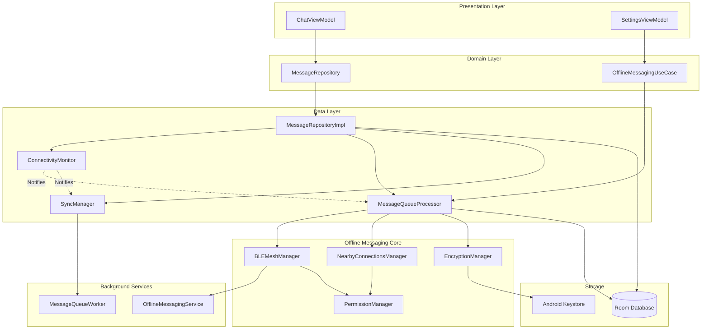
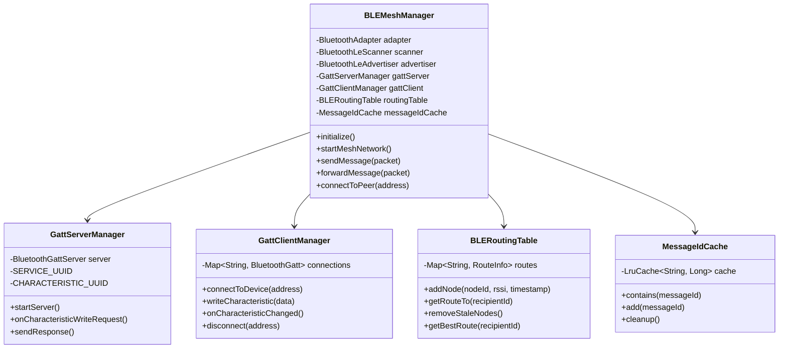
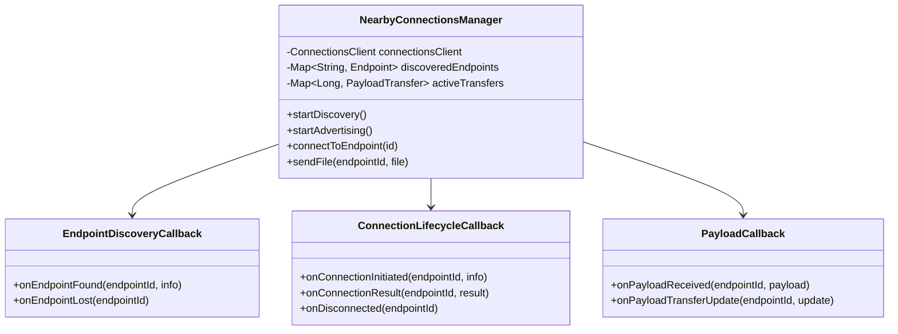
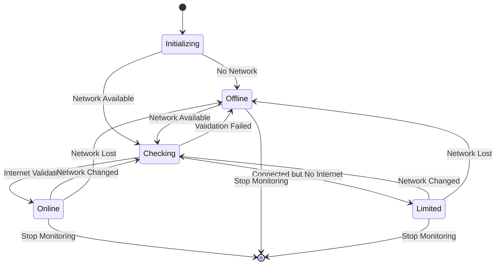
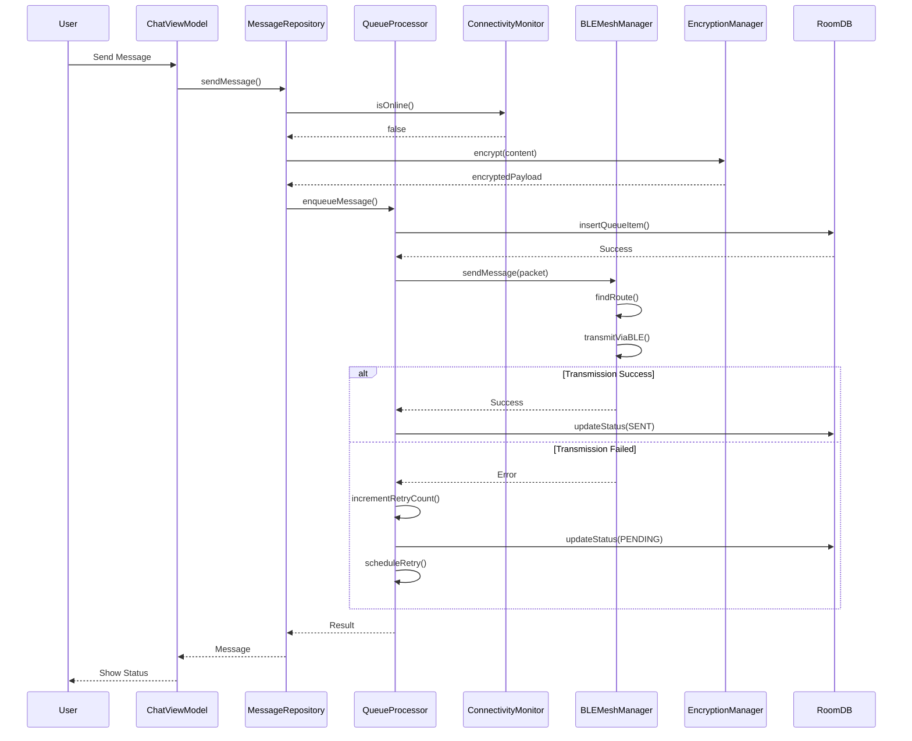
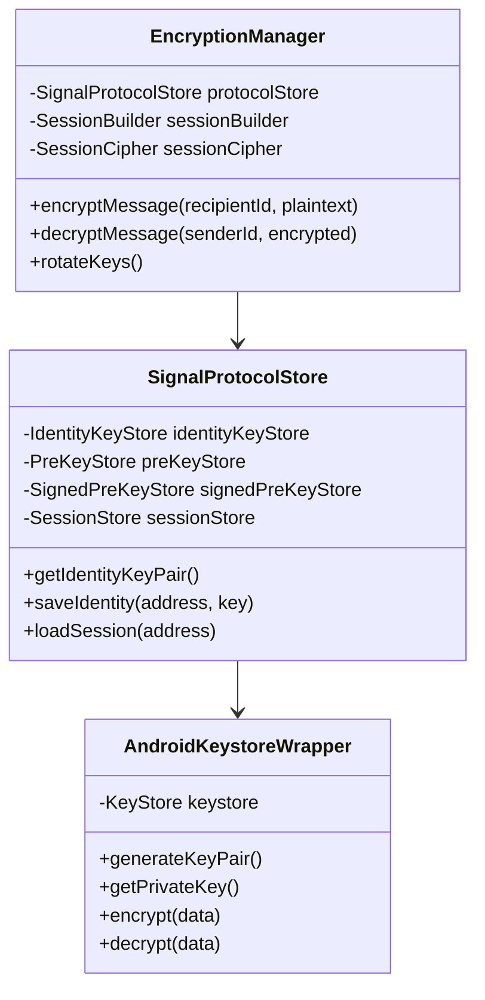
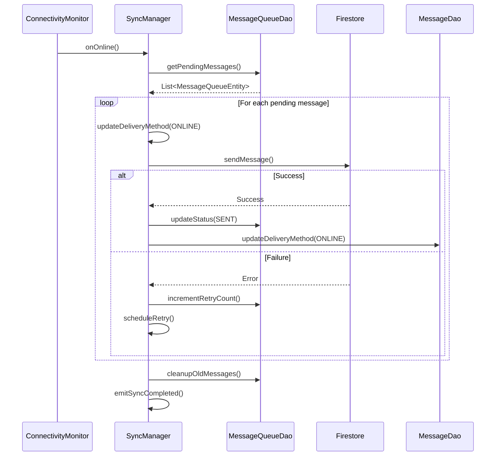
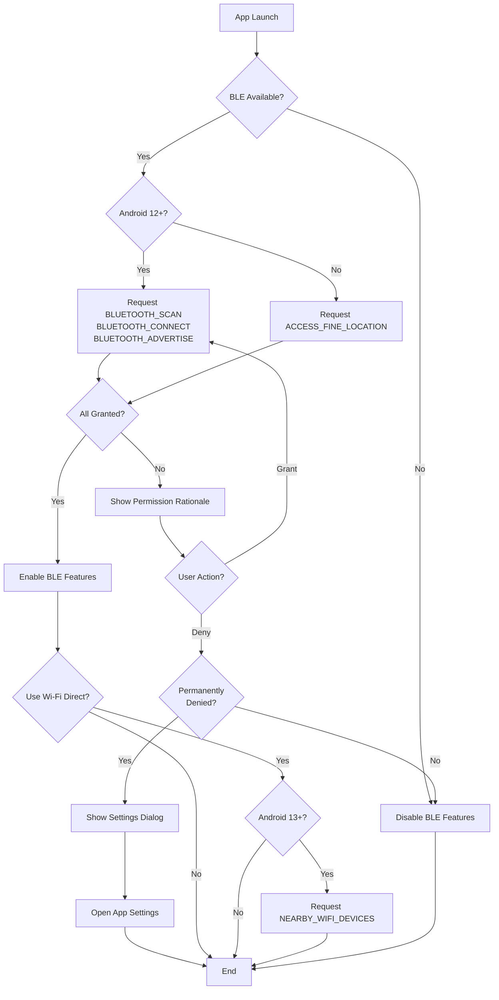

# Design Document: Offline Messaging

## Overview

Offline messaging özelliği, Linker Android uygulamasına internet bağlantısı olmadan mesajlaşma yeteneği kazandırır. Bu özellik, BLE (Bluetooth Low Energy) mesh networking ve Google Nearby Connections (Wi-Fi Direct) teknolojilerini kullanarak mesajların cihazlar arasında hop ederek hedefe ulaşmasını sağlar.

### Core Capabilities

1. **BLE Mesh Networking**: Mesajların yakındaki cihazlar üzerinden hop ederek hedefe ulaşması
2. **Wi-Fi Direct Transfer**: Büyük medya dosyalarının (>5MB) hızlı P2P transferi
3. **Automatic Connectivity Detection**: Online/offline durumlar arası otomatik geçiş
4. **End-to-End Encryption**: Signal Protocol ile offline mesajların şifrelenmesi
5. **Message Queue Management**: Offline mesajların kuyruğa alınması ve yönetimi
6. **Automatic Synchronization**: Online bağlantı geldiğinde otomatik senkronizasyon
7. **Battery Optimization**: Akıllı tarama ve bağlantı yönetimi ile pil tasarrufu

### Technology Stack

- **BLE API**: Android Bluetooth Low Energy GATT API
- **Nearby Connections**: Google Nearby Connections API (Wi-Fi Direct)
- **Encryption**: Signal Protocol (libsignal-client - Rust-based JNI library)
- **Database**: Room Database (MessageQueueEntity, BleNodeEntity, MessageIdCacheEntity)
- **Background Processing**: Foreground Service, WorkManager
- **Dependency Injection**: Hilt

### Integration Points

Bu özellik mevcut mesajlaşma altyapısı ile entegre çalışır:
- **MessageEntity**: `messageStatus`, `deliveryMethod`, `encryptedContent` alanları kullanılır
- **MessageQueueEntity**: Offline mesaj kuyruğu yönetimi
- **MessageRepositoryImpl**: `hasValidatedInternet()`, `queueMessageForOffline()` metodları genişletilir
- **Clean Architecture**: Data/Domain/Presentation katmanları korunur


## Architecture

### High-Level Architecture



### Layered Architecture

**Presentation Layer**
- `ChatViewModel`: Mesaj gönderme/alma UI logic
- `SettingsViewModel`: Offline messaging ayarları yönetimi
- `ChatScreen`: Mesaj durumu gösterimi (BLE/Online icons)

**Domain Layer**
- `MessageRepository`: Mesajlaşma interface
- `OfflineMessagingUseCase`: Offline messaging business logic

**Data Layer**
- `MessageRepositoryImpl`: Repository implementation
- `ConnectivityMonitor`: Bağlantı durumu izleme
- `MessageQueueProcessor`: Mesaj kuyruğu işleme
- `SyncManager`: Online senkronizasyon

**Offline Messaging Core**
- `BLEMeshManager`: BLE mesh network yönetimi
- `NearbyConnectionsManager`: Wi-Fi Direct transfer yönetimi
- `EncryptionManager`: E2E şifreleme
- `PermissionManager`: Runtime permission yönetimi

**Background Services**
- `OfflineMessagingService`: Foreground service (BLE scanning)
- `MessageQueueWorker`: WorkManager ile background sync

### Module Structure

```
app/src/main/java/com/linker/app/
├── core/
│   ├── di/
│   │   ├── ConnectivityModule.kt          # Connectivity DI
│   │   └── EncryptionModule.kt            # Encryption DI
│   ├── service/
│   │   └── OfflineMessagingService.kt     # Foreground Service
│   └── work/
│       └── MessageQueueWorker.kt          # Background sync worker
├── data/
│   ├── local/
│   │   ├── entity/
│   │   │   ├── BleNodeEntity.kt           # BLE mesh node cache
│   │   │   ├── MessageIdCacheEntity.kt    # Deduplication cache
│   │   │   └── MessageQueueEntity.kt      # (Existing) Message queue
│   │   └── dao/
│   │       ├── BleNodeDao.kt
│   │       └── MessageIdCacheDao.kt
│   ├── connectivity/
│   │   └── ConnectivityMonitor.kt         # Network state monitor
│   ├── ble/
│   │   ├── BLEMeshManager.kt              # BLE mesh core
│   │   ├── BLEPacket.kt                   # Packet structure
│   │   └── BLERoutingTable.kt             # Routing logic
│   ├── nearby/
│   │   └── NearbyConnectionsManager.kt    # Wi-Fi Direct manager
│   ├── encryption/
│   │   └── EncryptionManager.kt           # Signal Protocol wrapper
│   ├── queue/
│   │   ├── MessageQueueProcessor.kt       # Queue processing
│   │   └── SyncManager.kt                 # Online sync
│   └── permission/
│       └── PermissionManager.kt           # Permission handling
├── domain/
│   ├── usecase/
│   │   └── OfflineMessagingUseCase.kt     # Business logic
│   └── model/
│       └── BleNode.kt                     # Domain model
└── presentation/
    └── settings/
        └── OfflineMessagingSettingsScreen.kt
```


## Components and Interfaces

### 1. BLE Mesh Manager

**Responsibility**: BLE mesh network yönetimi, peer discovery, message routing

```kotlin
interface BLEMeshManager {
    // Lifecycle
    fun initialize()
    fun startMeshNetwork()
    fun stopMeshNetwork()
    
    // Peer Management
    fun startScanning()
    fun stopScanning()
    fun startAdvertising()
    fun stopAdvertising()
    suspend fun connectToPeer(deviceAddress: String): Result<Unit>
    suspend fun disconnectFromPeer(deviceAddress: String)
    
    // Message Routing
    suspend fun sendMessage(packet: BLEPacket): Result<Unit>
    suspend fun forwardMessage(packet: BLEPacket): Result<Unit>
    fun onMessageReceived(callback: (BLEPacket) -> Unit)
    
    // Routing Table
    suspend fun updateRoutingTable(nodeId: String, rssi: Int, timestamp: Long)
    suspend fun getRouteToPeer(recipientId: String): List<String>?
    suspend fun cleanupStaleNodes()
    
    // State
    fun observeConnectedPeers(): Flow<List<BleNode>>
    fun observeMeshStatus(): Flow<MeshStatus>
}

data class BleNode(
    val nodeId: String,
    val deviceAddress: String,
    val rssi: Int,
    val lastSeen: Long,
    val isConnected: Boolean
)

sealed class MeshStatus {
    object Idle : MeshStatus()
    object Scanning : MeshStatus()
    object Advertising : MeshStatus()
    data class Connected(val peerCount: Int) : MeshStatus()
    data class Error(val message: String) : MeshStatus()
}
```

**Component Diagram**:



**Key Implementation Details**:

1. **BLE Service UUID**: `00001234-0000-1000-8000-00805f9b34fb` (Linker Mesh Service)
2. **Characteristic UUID**: `00001235-0000-1000-8000-00805f9b34fb` (Message Characteristic)
3. **Max Concurrent Connections**: 7 (Android BLE limit)
4. **Scan Mode**: `SCAN_MODE_LOW_LATENCY` when screen on, `SCAN_MODE_LOW_POWER` when screen off
5. **Advertise Mode**: `ADVERTISE_MODE_LOW_POWER` with 1000ms interval
6. **MTU Size**: 512 bytes (negotiated via `requestMtu()`)

### 2. Nearby Connections Manager

**Responsibility**: Wi-Fi Direct ile büyük medya dosyalarının P2P transferi

```kotlin
interface NearbyConnectionsManager {
    // Discovery
    suspend fun startDiscovery(): Result<Unit>
    suspend fun stopDiscovery()
    suspend fun startAdvertising(): Result<Unit>
    suspend fun stopAdvertising()
    
    // Connection
    suspend fun connectToEndpoint(endpointId: String): Result<Unit>
    suspend fun disconnectFromEndpoint(endpointId: String)
    
    // Transfer
    suspend fun sendFile(
        endpointId: String,
        file: File,
        onProgress: (bytesTransferred: Long, totalBytes: Long) -> Unit
    ): Result<Unit>
    
    suspend fun receiveFile(
        payloadId: Long,
        onProgress: (bytesTransferred: Long, totalBytes: Long) -> Unit
    ): Result<File>
    
    // State
    fun observeDiscoveredEndpoints(): Flow<List<NearbyEndpoint>>
    fun observeTransferProgress(): Flow<TransferProgress>
}

data class NearbyEndpoint(
    val endpointId: String,
    val endpointName: String,
    val userId: String
)

data class TransferProgress(
    val payloadId: Long,
    val bytesTransferred: Long,
    val totalBytes: Long,
    val status: TransferStatus
)

enum class TransferStatus {
    IN_PROGRESS, SUCCESS, FAILURE, CANCELED
}
```

**Component Diagram**:



**Key Implementation Details**:

1. **Strategy**: `STRATEGY_P2P_POINT_TO_POINT` (1-to-1 connection)
2. **Service ID**: `com.linker.app.OFFLINE_MESSAGING`
3. **Connection Timeout**: 10 seconds
4. **Transfer Chunk Size**: 64KB
5. **Max File Size**: 100MB (configurable)

### 3. Connectivity Monitor

**Responsibility**: Network bağlantı durumunu izleme ve değişiklikleri bildirme

```kotlin
interface ConnectivityMonitor {
    fun startMonitoring()
    fun stopMonitoring()
    fun isOnline(): Boolean
    fun isMetered(): Boolean
    fun observeConnectivityState(): Flow<ConnectivityState>
}

sealed class ConnectivityState {
    object Online : ConnectivityState()
    object Offline : ConnectivityState()
    data class Limited(val isMetered: Boolean) : ConnectivityState()
}
```

**State Machine Diagram**:



**Implementation**:

```kotlin
class ConnectivityMonitorImpl @Inject constructor(
    @ApplicationContext private val context: Context
) : ConnectivityMonitor {
    
    private val connectivityManager = context.getSystemService(Context.CONNECTIVITY_SERVICE) 
        as ConnectivityManager
    
    private val _connectivityState = MutableStateFlow<ConnectivityState>(ConnectivityState.Offline)
    
    private val networkCallback = object : ConnectivityManager.NetworkCallback() {
        override fun onAvailable(network: Network) {
            checkInternetValidation(network)
        }
        
        override fun onCapabilitiesChanged(
            network: Network,
            capabilities: NetworkCapabilities
        ) {
            val hasInternet = capabilities.hasCapability(
                NetworkCapabilities.NET_CAPABILITY_INTERNET
            )
            val isValidated = capabilities.hasCapability(
                NetworkCapabilities.NET_CAPABILITY_VALIDATED
            )
            val isMetered = !capabilities.hasCapability(
                NetworkCapabilities.NET_CAPABILITY_NOT_METERED
            )
            
            _connectivityState.value = when {
                hasInternet && isValidated -> ConnectivityState.Online
                hasInternet && !isValidated -> ConnectivityState.Limited(isMetered)
                else -> ConnectivityState.Offline
            }
        }
        
        override fun onLost(network: Network) {
            _connectivityState.value = ConnectivityState.Offline
        }
    }
    
    override fun startMonitoring() {
        val request = NetworkRequest.Builder()
            .addCapability(NetworkCapabilities.NET_CAPABILITY_INTERNET)
            .build()
        connectivityManager.registerNetworkCallback(request, networkCallback)
    }
    
    override fun observeConnectivityState(): Flow<ConnectivityState> = _connectivityState
}
```

### 4. Message Queue Processor

**Responsibility**: Offline mesaj kuyruğunu işleme ve gönderim yönetimi

```kotlin
interface MessageQueueProcessor {
    suspend fun enqueueMessage(
        messageId: String,
        chatId: String,
        recipientId: String,
        payload: String,
        deliveryMethod: DeliveryMethod
    ): Result<Unit>
    
    suspend fun processQueue()
    suspend fun retryFailedMessages()
    suspend fun cancelMessage(messageId: String)
    suspend fun clearSentMessages()
    
    fun observeQueueStatus(): Flow<QueueStatus>
    fun observePendingCount(): Flow<Int>
}

data class QueueStatus(
    val pendingCount: Int,
    val sendingCount: Int,
    val failedCount: Int
)

/**
 * Race Condition Handler - Prevents duplicate message processing
 * 
 * Handles Requirement 18.8: "Message_Repository SHALL handle race conditions 
 * when same message arrives via both BLE and online"
 * 
 * This manager tracks MessageEntity.messageId to prevent the same logical message
 * from being inserted twice when it arrives via both BLE and online channels.
 * 
 * Note: This is separate from BLE packet deduplication (MessageIdCache), which
 * prevents the same BLE packet from being processed multiple times when it arrives
 * via different mesh routes.
 */
class MessageDeduplicationManager {
    private val processedMessageIds = ConcurrentHashMap<String, Long>()
    private val MESSAGE_DEDUP_WINDOW = 60_000L // 60 seconds
    
    /**
     * Check if message was recently processed
     * @param messageId The MessageEntity.messageId (not BLE packet ID)
     * @return true if message is duplicate, false if new
     */
    fun isDuplicate(messageId: String): Boolean {
        val lastProcessed = processedMessageIds[messageId]
        return lastProcessed != null && 
               System.currentTimeMillis() - lastProcessed < MESSAGE_DEDUP_WINDOW
    }
    
    /**
     * Mark message as processed
     * @param messageId The MessageEntity.messageId to mark
     */
    fun markAsProcessed(messageId: String) {
        processedMessageIds[messageId] = System.currentTimeMillis()
    }
    
    /**
     * Remove old entries to prevent memory leak
     * Should be called periodically (e.g., every 5 minutes)
     */
    fun cleanupOldEntries() {
        val now = System.currentTimeMillis()
        processedMessageIds.entries.removeIf { (_, timestamp) ->
            now - timestamp > MESSAGE_DEDUP_WINDOW
        }
    }
}
```

**Sequence Diagram - Message Processing**:



### 5. Encryption Manager

**Responsibility**: Signal Protocol kullanarak E2E şifreleme

```kotlin
interface EncryptionManager {
    suspend fun initialize()
    suspend fun encryptMessage(recipientId: String, plaintext: String): Result<EncryptedMessage>
    suspend fun decryptMessage(senderId: String, encrypted: EncryptedMessage): Result<String>
    suspend fun hasKeysFor(userId: String): Boolean
    suspend fun rotateKeys()
}

/**
 * Encrypted message using Signal Protocol.
 * Contains serialized SignalMessage or PreKeySignalMessage.
 */
data class EncryptedMessage(
    val signalMessage: ByteArray  // Serialized SignalMessage from libsignal-android
)
```

**Component Diagram**:



**Key Implementation Details**:

1. **Protocol**: Signal Protocol (Double Ratchet Algorithm)
2. **Key Storage**: Android Keystore (hardware-backed)
3. **Key Rotation**: Every 30 days
4. **Pre-Key Bundle**: 100 one-time pre-keys
5. **Session Management**: Persistent sessions in Room DB

### 6. Sync Manager

**Responsibility**: Online bağlantı geldiğinde offline mesajları senkronize etme

```kotlin
interface SyncManager {
    suspend fun syncPendingMessages(): Result<SyncResult>
    suspend fun syncFailedMessages(): Result<SyncResult>
    fun observeSyncStatus(): Flow<SyncStatus>
}

data class SyncResult(
    val successCount: Int,
    val failedCount: Int,
    val errors: List<String>
)

sealed class SyncStatus {
    object Idle : SyncStatus()
    data class Syncing(val progress: Int, val total: Int) : SyncStatus()
    data class Completed(val result: SyncResult) : SyncStatus()
    data class Error(val message: String) : SyncStatus()
}
```

**Sequence Diagram - Online Sync**:




## Data Models

### Database Schema Updates

#### 1. BleNodeEntity (New)

```kotlin
@Entity(
    tableName = "ble_nodes",
    indices = [
        Index(value = ["lastSeen"]),
        Index(value = ["isConnected"])
    ]
)
data class BleNodeEntity(
    @PrimaryKey
    val nodeId: String,              // User ID of the node
    val deviceAddress: String,       // BLE MAC address
    val deviceName: String?,         // Device name
    val rssi: Int,                   // Signal strength
    val lastSeen: Long,              // Last seen timestamp
    val isConnected: Boolean,        // Connection status
    val hopCount: Int = 1,           // Hops to reach this node
    val routeQuality: Float = 0f,    // Route quality score (0-1)
    val createdAt: Long,
    val updatedAt: Long
)
```

#### 2. MessageIdCacheEntity (New)

```kotlin
@Entity(
    tableName = "message_id_cache",
    indices = [Index(value = ["receivedAt"])]
)
data class MessageIdCacheEntity(
    @PrimaryKey
    val messageId: String,           // Message UUID
    val receivedAt: Long,            // When message was first seen
    val sourceNodeId: String         // Node that sent it
)
```

#### 3. MessageQueueEntity (Existing - No Changes)

Already defined with required fields:
- `queueId`, `messageId`, `chatId`, `recipientId`
- `messagePayload`, `queueStatus`, `deliveryMethod`
- `retryCount`, `maxRetries`, `priority`, `ttl`
- `createdAt`, `lastAttemptAt`, `sentAt`, `errorMessage`

**Priority Semantics**:
```kotlin
/**
 * Message priority for queue processing.
 * 
 * LOWER number = HIGHER priority (processed first)
 * This follows Unix nice value convention.
 * 
 * - Priority 0: Text messages (small, urgent, processed first)
 * - Priority 1: Media messages (large, can wait, processed after text)
 */
const val PRIORITY_TEXT = 0
const val PRIORITY_MEDIA = 1
```

#### 4. MessageEntity (Existing - No Changes)

Already has required fields:
- `messageStatus`: MessageStatus enum
- `deliveryMethod`: DeliveryMethod enum (ONLINE, BLE, WIFI_DIRECT)
- `encryptedContent`: String? for E2E encryption

### Room Database Migration

```kotlin
// Migration 7 to 8: Add offline messaging tables
val MIGRATION_7_8 = object : Migration(7, 8) {
    override fun migrate(db: SupportSQLiteDatabase) {
        // Create ble_nodes table
        db.execSQL("""
            CREATE TABLE IF NOT EXISTS ble_nodes (
                nodeId TEXT PRIMARY KEY NOT NULL,
                deviceAddress TEXT NOT NULL,
                deviceName TEXT,
                rssi INTEGER NOT NULL,
                lastSeen INTEGER NOT NULL,
                isConnected INTEGER NOT NULL,
                hopCount INTEGER NOT NULL DEFAULT 1,
                routeQuality REAL NOT NULL DEFAULT 0.0,
                createdAt INTEGER NOT NULL,
                updatedAt INTEGER NOT NULL
            )
        """)
        
        db.execSQL("CREATE INDEX IF NOT EXISTS index_ble_nodes_lastSeen ON ble_nodes(lastSeen)")
        db.execSQL("CREATE INDEX IF NOT EXISTS index_ble_nodes_isConnected ON ble_nodes(isConnected)")
        
        // Create message_id_cache table
        db.execSQL("""
            CREATE TABLE IF NOT EXISTS message_id_cache (
                messageId TEXT PRIMARY KEY NOT NULL,
                receivedAt INTEGER NOT NULL,
                sourceNodeId TEXT NOT NULL
            )
        """)
        
        db.execSQL("CREATE INDEX IF NOT EXISTS index_message_id_cache_receivedAt ON message_id_cache(receivedAt)")
    }
}
```

### BLE Mesh Protocol Packet Structure

```kotlin
/**
 * BLE Mesh Packet Structure
 * 
 * Total size: Variable (max 512 bytes with MTU negotiation)
 */
data class BLEPacket(
    val version: Byte = 1,                    // Protocol version (1 byte)
    val messageId: String,                    // UUID (16 bytes)
    val senderId: String,                     // User ID (variable, max 36 bytes)
    val recipientId: String,                  // User ID (variable, max 36 bytes)
    val ttl: Byte,                           // Time-to-live in hops (1 byte)
    val hopCount: Byte,                      // Current hop count (1 byte)
    val fragmentIndex: Short = 0,            // Fragment index (2 bytes)
    val totalFragments: Short = 1,           // Total fragments (2 bytes)
    val payloadLength: Short,                // Payload length (2 bytes)
    val encryptedPayload: ByteArray,         // Encrypted message content
    val checksum: Int                        // CRC32 checksum (4 bytes)
) {
    companion object {
        // Header: version(1) + messageId(36) + senderId(36) + recipientId(36) + ttl(1) + hopCount(1)
        //         + fragmentIndex(2) + totalFragments(2) + payloadLength(2) + checksum(4)
        const val HEADER_SIZE = 1 + 36 + 36 + 36 + 1 + 1 + 2 + 2 + 2 + 4 // 121 bytes
        const val MAX_PAYLOAD_SIZE = 512 - HEADER_SIZE // 391 bytes
        const val MTU_SIZE = 512
        
        fun serialize(packet: BLEPacket): ByteArray {
            return ByteBuffer.allocate(HEADER_SIZE + packet.payloadLength)
                .put(packet.version)
                .put(packet.messageId.toByteArray())
                .put(packet.senderId.toByteArray().padEnd(36))
                .put(packet.recipientId.toByteArray().padEnd(36))
                .put(packet.ttl)
                .put(packet.hopCount)
                .putShort(packet.fragmentIndex)
                .putShort(packet.totalFragments)
                .putShort(packet.payloadLength)
                .put(packet.encryptedPayload)
                .putInt(packet.checksum)
                .array()
        }
        
        fun deserialize(data: ByteArray): BLEPacket {
            val buffer = ByteBuffer.wrap(data)
            val version = buffer.get()
            val messageIdBytes = ByteArray(16)
            buffer.get(messageIdBytes)
            val senderIdBytes = ByteArray(36)
            buffer.get(senderIdBytes)
            val recipientIdBytes = ByteArray(36)
            buffer.get(recipientIdBytes)
            val ttl = buffer.get()
            val hopCount = buffer.get()
            val fragmentIndex = buffer.getShort()
            val totalFragments = buffer.getShort()
            val payloadLength = buffer.getShort()
            val payload = ByteArray(payloadLength.toInt())
            buffer.get(payload)
            val checksum = buffer.getInt()
            
            return BLEPacket(
                version = version,
                messageId = String(messageIdBytes).trim(),
                senderId = String(senderIdBytes).trim(),
                recipientId = String(recipientIdBytes).trim(),
                ttl = ttl,
                hopCount = hopCount,
                fragmentIndex = fragmentIndex,
                totalFragments = totalFragments,
                payloadLength = payloadLength,
                encryptedPayload = payload,
                checksum = checksum
            )
        }
        
        fun calculateChecksum(data: ByteArray): Int {
            val crc32 = CRC32()
            crc32.update(data)
            return crc32.value.toInt()
        }
    }
}

/**
 * Packet fragmentation for large messages
 */
object PacketFragmenter {
    fun fragment(packet: BLEPacket): List<BLEPacket> {
        if (packet.encryptedPayload.size <= BLEPacket.MAX_PAYLOAD_SIZE) {
            return listOf(packet)
        }
        
        val fragments = mutableListOf<BLEPacket>()
        val totalFragments = (packet.encryptedPayload.size + BLEPacket.MAX_PAYLOAD_SIZE - 1) / 
                             BLEPacket.MAX_PAYLOAD_SIZE
        
        for (i in 0 until totalFragments) {
            val start = i * BLEPacket.MAX_PAYLOAD_SIZE
            val end = minOf(start + BLEPacket.MAX_PAYLOAD_SIZE, packet.encryptedPayload.size)
            val fragmentPayload = packet.encryptedPayload.copyOfRange(start, end)
            
            fragments.add(
                packet.copy(
                    fragmentIndex = i.toShort(),
                    totalFragments = totalFragments.toShort(),
                    payloadLength = fragmentPayload.size.toShort(),
                    encryptedPayload = fragmentPayload,
                    checksum = BLEPacket.calculateChecksum(fragmentPayload)
                )
            )
        }
        
        return fragments
    }
    
    fun reassemble(fragments: List<BLEPacket>): BLEPacket? {
        if (fragments.isEmpty()) return null
        
        val sorted = fragments.sortedBy { it.fragmentIndex }
        if (sorted.size != sorted.first().totalFragments.toInt()) return null
        
        val fullPayload = ByteArrayOutputStream()
        sorted.forEach { fullPayload.write(it.encryptedPayload) }
        
        return sorted.first().copy(
            fragmentIndex = 0,
            totalFragments = 1,
            payloadLength = fullPayload.size().toShort(),
            encryptedPayload = fullPayload.toByteArray(),
            checksum = BLEPacket.calculateChecksum(fullPayload.toByteArray())
        )
    }
}

/**
 * Fragment Manager - Handles incomplete fragment cleanup
 * 
 * Prevents memory leaks from incomplete fragmented messages
 */
class FragmentManager {
    private val fragmentMap = ConcurrentHashMap<String, FragmentState>()
    private val FRAGMENT_TIMEOUT = 30_000L // 30 seconds
    
    data class FragmentState(
        val fragments: MutableList<BLEPacket>,
        val receivedAt: Long
    )
    
    fun addFragment(packet: BLEPacket): BLEPacket? {
        val key = packet.messageId
        val state = fragmentMap.getOrPut(key) {
            FragmentState(mutableListOf(), System.currentTimeMillis())
        }
        
        state.fragments.add(packet)
        
        // Check if complete
        if (state.fragments.size == packet.totalFragments.toInt()) {
            fragmentMap.remove(key)
            return PacketFragmenter.reassemble(state.fragments)
        }
        
        return null
    }
    
    /**
     * Remove fragments that haven't been completed within timeout period
     * Should be called periodically (e.g., every 60 seconds)
     */
    fun cleanupStaleFragments() {
        val now = System.currentTimeMillis()
        fragmentMap.entries.removeIf { (_, state) ->
            now - state.receivedAt > FRAGMENT_TIMEOUT
        }
    }
    
    fun getPendingFragmentCount(): Int = fragmentMap.size
}
```

### Routing Table Structure

```kotlin
data class RouteInfo(
    val targetNodeId: String,
    val nextHopAddress: String,      // BLE address of next hop
    val hopCount: Int,               // Number of hops to target
    val rssi: Int,                   // Signal strength to next hop
    val routeQuality: Float,         // Calculated route quality (0-1)
    val lastUpdated: Long
)

class BLERoutingTable {
    private val routes = ConcurrentHashMap<String, RouteInfo>()
    
    fun addRoute(route: RouteInfo) {
        val existing = routes[route.targetNodeId]
        if (existing == null || route.routeQuality > existing.routeQuality) {
            routes[route.targetNodeId] = route
        }
    }
    
    fun getRoute(targetNodeId: String): RouteInfo? {
        return routes[targetNodeId]?.takeIf { 
            System.currentTimeMillis() - it.lastUpdated < 60_000 // 60 seconds
        }
    }
    
    fun removeStaleRoutes() {
        val now = System.currentTimeMillis()
        routes.entries.removeIf { (_, route) ->
            now - route.lastUpdated > 60_000
        }
    }
    
    fun calculateRouteQuality(rssi: Int, hopCount: Int): Float {
        // Quality = (RSSI factor) * (Hop penalty)
        // RSSI: -30 dBm (excellent) to -90 dBm (poor)
        val rssiNormalized = ((rssi + 90) / 60f).coerceIn(0f, 1f)
        val hopPenalty = 1f / (1f + hopCount * 0.2f)
        return rssiNormalized * hopPenalty
    }
}
```

### Domain Models

```kotlin
// Domain model for BLE node
data class BleNode(
    val nodeId: String,
    val deviceAddress: String,
    val deviceName: String?,
    val rssi: Int,
    val lastSeen: Long,
    val isConnected: Boolean,
    val hopCount: Int,
    val routeQuality: Float
)

// Mapper extensions
fun BleNodeEntity.toDomain() = BleNode(
    nodeId = nodeId,
    deviceAddress = deviceAddress,
    deviceName = deviceName,
    rssi = rssi,
    lastSeen = lastSeen,
    isConnected = isConnected,
    hopCount = hopCount,
    routeQuality = routeQuality
)

fun BleNode.toEntity(createdAt: Long, updatedAt: Long) = BleNodeEntity(
    nodeId = nodeId,
    deviceAddress = deviceAddress,
    deviceName = deviceName,
    rssi = rssi,
    lastSeen = lastSeen,
    isConnected = isConnected,
    hopCount = hopCount,
    routeQuality = routeQuality,
    createdAt = createdAt,
    updatedAt = updatedAt
)
```


## Correctness Properties

*A property is a characteristic or behavior that should hold true across all valid executions of a system—essentially, a formal statement about what the system should do. Properties serve as the bridge between human-readable specifications and machine-verifiable correctness guarantees.*

### Property Reflection

After analyzing all acceptance criteria, I identified the following properties suitable for property-based testing. Several criteria were combined to eliminate redundancy:

**Combined Properties:**
- Requirements 3.1, 3.2, 3.3 → Property 1 (Message queueing completeness)
- Requirements 16.3, 16.4 → Property 8 (Packet fragmentation)
- Requirements 16.1, 16.5 → Property 9 (Packet serialization round-trip)

**Properties Identified:**
1. Message queueing with correct attributes (3.1, 3.2, 3.3)
2. Priority assignment based on message type (3.4)
3. Message encryption before queueing (3.5)
4. Route selection optimization (4.2)
5. Packet structure completeness (4.3)
6. Message deduplication (4.4)
7. TTL-based forwarding (4.5)
8. Packet fragmentation and reassembly (16.3, 16.4, 16.5)
9. Packet serialization round-trip (16.1)
10. Checksum validation (16.6)
11. Encryption round-trip (6.5)
12. Forwarding preserves encryption (6.4)
13. Connectivity state to delivery method mapping (2.4)
14. Sync delivery method update (7.2)
15. Sync chronological ordering (7.3)

### Property 1: Message Queueing Completeness

*For any* message sent without internet connection, when queued by the Message_Queue_Processor, the resulting MessageQueueEntity SHALL have status PENDING, delivery method BLE, and TTL value of 5.

**Validates: Requirements 3.1, 3.2, 3.3**

### Property 2: Priority Assignment by Message Type

*For any* message queued for offline delivery, the Message_Queue_Processor SHALL assign priority 0 for text messages and priority 1 for media messages.

**Validates: Requirements 3.4**

### Property 3: Message Encryption Before Queueing

*For any* message queued for offline delivery, the encrypted payload stored in MessageQueueEntity SHALL differ from the original plaintext content.

**Validates: Requirements 3.5**

### Property 4: Optimal Route Selection

*For any* set of available routes to a recipient, the BLE_Mesh_Manager SHALL select the route with the minimum hop count.

**Validates: Requirements 4.2**

### Property 5: Packet Structure Completeness

*For any* message transmitted via BLE mesh, the resulting BLEPacket SHALL contain all required fields: sender ID, recipient ID, message ID, TTL, hop count, payload length, and encrypted payload.

**Validates: Requirements 4.3**

### Property 6: Message Deduplication

*For any* message ID that exists in the message ID cache, when a mesh node receives a packet with that message ID, the BLE_Mesh_Manager SHALL reject the packet as a duplicate.

**Validates: Requirements 4.4**

### Property 7: TTL-Based Forwarding

*For any* message received by a mesh node where the recipient is not the current node, if TTL > 0, the BLE_Mesh_Manager SHALL forward the message with TTL decremented by 1.

**Validates: Requirements 4.5**

### Property 8: Packet Fragmentation and Reassembly Round-Trip

*For any* message payload, if the payload size exceeds BLE MTU (512 bytes), fragmenting the packet and then reassembling the fragments SHALL produce a packet equivalent to the original.

**Validates: Requirements 16.3, 16.4, 16.5**

### Property 9: Packet Serialization Round-Trip

*For any* valid BLEPacket, serializing the packet to bytes and then deserializing SHALL produce a packet with all fields equal to the original packet.

**Validates: Requirements 16.1**

### Property 10: Checksum Validation

*For any* BLEPacket with a valid checksum, the BLE_Mesh_Manager SHALL accept the packet for processing, and for any packet with an invalid checksum, the BLE_Mesh_Manager SHALL reject the packet.

**Validates: Requirements 16.6**

### Property 11: Encryption Round-Trip

*For any* message content and recipient, encrypting the content with the recipient's public key and then decrypting with the recipient's private key SHALL yield the original content.

**Validates: Requirements 6.5**

### Property 12: Forwarding Preserves Encryption

*For any* encrypted message forwarded by a mesh node, the encrypted payload in the forwarded packet SHALL be identical to the encrypted payload in the received packet.

**Validates: Requirements 6.4**

### Property 13: Connectivity State to Delivery Method Mapping

*For any* connectivity state change detected by the Connectivity_Monitor, the delivery method preference SHALL be updated to ONLINE when state is Online, and to BLE when state is Offline or Limited.

**Validates: Requirements 2.4**

### Property 14: Sync Updates Delivery Method

*For any* message with delivery method BLE that is successfully synced to Firestore, the Sync_Manager SHALL update the message's delivery method to ONLINE.

**Validates: Requirements 7.2**

### Property 15: Sync Chronological Ordering

*For any* set of pending messages retrieved for synchronization, the Sync_Manager SHALL send messages to Firestore in ascending order of their createdAt timestamps.

**Validates: Requirements 7.3**


## Error Handling

### Error Categories

#### 1. BLE Errors

**Connection Errors**
- `BLE_ADAPTER_NOT_AVAILABLE`: BLE adapter is null or disabled
- `BLE_PERMISSION_DENIED`: Required BLE permissions not granted
- `GATT_CONNECTION_FAILED`: Failed to establish GATT connection
- `GATT_CONNECTION_TIMEOUT`: Connection attempt exceeded 5 seconds
- `MAX_CONNECTIONS_REACHED`: Already connected to 7 devices (Android limit)

**Transmission Errors**
- `CHARACTERISTIC_WRITE_FAILED`: Failed to write to GATT characteristic
- `MTU_NEGOTIATION_FAILED`: Failed to negotiate MTU size
- `PACKET_TOO_LARGE`: Packet exceeds maximum size after fragmentation
- `TRANSMISSION_TIMEOUT`: No acknowledgment received within timeout

**Routing Errors**
- `NO_ROUTE_TO_RECIPIENT`: No available route to recipient in routing table
- `TTL_EXHAUSTED`: Message TTL reached 0 before reaching recipient
- `ROUTING_TABLE_FULL`: Cannot add more routes to routing table

**Error Handling Strategy**:
```kotlin
sealed class BLEError : Exception() {
    data class ConnectionError(val code: Int, override val message: String) : BLEError()
    data class TransmissionError(val code: Int, override val message: String) : BLEError()
    data class RoutingError(override val message: String) : BLEError()
    
    fun toUserMessage(): String = when (this) {
        is ConnectionError -> "Unable to connect to nearby devices. Check Bluetooth settings."
        is TransmissionError -> "Message transmission failed. Will retry automatically."
        is RoutingError -> "No route found to recipient. Message will be sent when online."
    }
}

class BLEErrorHandler {
    fun handleError(error: BLEError, context: ErrorContext): ErrorAction {
        return when (error) {
            is BLEError.ConnectionError -> {
                if (error.code == BluetoothGatt.GATT_FAILURE) {
                    ErrorAction.Retry(delay = RetryStrategy.INITIAL_DELAY, maxAttempts = 3)
                } else {
                    ErrorAction.Fail(error.toUserMessage())
                }
            }
            is BLEError.TransmissionError -> {
                // Use consistent retry delay from RetryStrategy (5000ms)
                ErrorAction.Retry(delay = RetryStrategy.INITIAL_DELAY, maxAttempts = 3)
            }
            is BLEError.RoutingError -> {
                ErrorAction.QueueForOnlineSync
            }
        }
    }
}

sealed class ErrorAction {
    data class Retry(val delay: Long, val maxAttempts: Int) : ErrorAction()
    data class Fail(val userMessage: String) : ErrorAction()
    object QueueForOnlineSync : ErrorAction()
}
```

#### 2. Encryption Errors

**Key Management Errors**
- `PUBLIC_KEY_NOT_FOUND`: Recipient's public key not available locally
- `PRIVATE_KEY_NOT_FOUND`: User's private key not found in Keystore
- `KEY_GENERATION_FAILED`: Failed to generate encryption keys
- `KEYSTORE_ACCESS_DENIED`: Cannot access Android Keystore

**Encryption/Decryption Errors**
- `ENCRYPTION_FAILED`: Failed to encrypt message content
- `DECRYPTION_FAILED`: Failed to decrypt received message
- `INVALID_CIPHERTEXT`: Received ciphertext is malformed
- `SESSION_NOT_FOUND`: No Signal Protocol session with sender

**Error Handling Strategy**:
```kotlin
sealed class EncryptionError : Exception() {
    object PublicKeyNotFound : EncryptionError()
    object PrivateKeyNotFound : EncryptionError()
    data class EncryptionFailed(override val message: String) : EncryptionError()
    data class DecryptionFailed(override val message: String) : EncryptionError()
    
    fun isRecoverable(): Boolean = when (this) {
        is PublicKeyNotFound -> false  // Cannot send without recipient's key
        is PrivateKeyNotFound -> false // Cannot decrypt without own key
        is EncryptionFailed -> false   // Encryption failure is not recoverable
        is DecryptionFailed -> true    // May be temporary corruption
    }
}

class EncryptionErrorHandler {
    suspend fun handleError(error: EncryptionError, messageId: String): ErrorAction {
        return when (error) {
            is EncryptionError.PublicKeyNotFound -> {
                // Mark message as failed, notify user to exchange keys
                messageQueueDao.updateStatus(messageId, QueueStatus.FAILED)
                ErrorAction.Fail("Cannot send encrypted message. Recipient's encryption key not available.")
            }
            is EncryptionError.DecryptionFailed -> {
                // Log error, request key re-exchange
                ErrorAction.RequestKeyExchange
            }
            else -> ErrorAction.Fail(error.message ?: "Encryption error")
        }
    }
}
```

#### 3. Network Errors

**Connectivity Errors**
- `NETWORK_UNAVAILABLE`: No network connection available
- `INTERNET_VALIDATION_FAILED`: Connected but no internet access
- `FIRESTORE_TIMEOUT`: Firestore operation timed out
- `FIRESTORE_PERMISSION_DENIED`: User lacks permission for operation

**Sync Errors**
- `SYNC_RATE_LIMIT_EXCEEDED`: Exceeded 10 messages per second limit
- `SYNC_CONFLICT`: Message already exists in Firestore with different content
- `SYNC_BATCH_FAILED`: Batch write to Firestore failed

**Error Handling Strategy**:
```kotlin
sealed class NetworkError : Exception() {
    object NetworkUnavailable : NetworkError()
    data class FirestoreError(val code: Int, override val message: String) : NetworkError()
    data class SyncError(override val message: String) : NetworkError()
}

class NetworkErrorHandler {
    suspend fun handleError(error: NetworkError, context: SyncContext): ErrorAction {
        return when (error) {
            is NetworkError.NetworkUnavailable -> {
                // Switch to offline mode
                ErrorAction.SwitchToOfflineMode
            }
            is NetworkError.FirestoreError -> {
                if (error.code == FirebaseFirestoreException.Code.UNAVAILABLE.value()) {
                    ErrorAction.Retry(delay = 10000, maxAttempts = 5)
                } else {
                    ErrorAction.Fail(error.message)
                }
            }
            is NetworkError.SyncError -> {
                ErrorAction.Retry(delay = 5000, maxAttempts = 3)
            }
        }
    }
}
```

#### 4. Permission Errors

**Permission Types**
- `BLUETOOTH_SCAN`: Required for BLE scanning (Android 12+)
- `BLUETOOTH_CONNECT`: Required for BLE connections (Android 12+)
- `BLUETOOTH_ADVERTISE`: Required for BLE advertising (Android 12+)
- `ACCESS_FINE_LOCATION`: Required for BLE on Android < 12
- `NEARBY_WIFI_DEVICES`: Required for Nearby Connections (Android 13+)

**Error Handling Strategy**:
```kotlin
class PermissionErrorHandler(
    private val activity: Activity
) {
    fun handlePermissionDenied(permission: String) {
        when (permission) {
            Manifest.permission.BLUETOOTH_SCAN,
            Manifest.permission.BLUETOOTH_CONNECT,
            Manifest.permission.BLUETOOTH_ADVERTISE -> {
                showPermissionRationale(
                    title = "Bluetooth Permission Required",
                    message = "Offline messaging requires Bluetooth to communicate with nearby devices.",
                    action = "Grant Permission"
                ) {
                    requestPermission(permission)
                }
            }
            Manifest.permission.ACCESS_FINE_LOCATION -> {
                showPermissionRationale(
                    title = "Location Permission Required",
                    message = "Android requires location permission for Bluetooth scanning.",
                    action = "Grant Permission"
                ) {
                    requestPermission(permission)
                }
            }
            "android.permission.NEARBY_WIFI_DEVICES" -> {
                showPermissionRationale(
                    title = "Nearby Devices Permission Required",
                    message = "Required for fast media transfer via Wi-Fi Direct.",
                    action = "Grant Permission"
                ) {
                    requestPermission(permission)
                }
            }
        }
    }
    
    fun handlePermissionPermanentlyDenied(permission: String) {
        showSettingsDialog(
            title = "Permission Required",
            message = "Please enable ${permission.toReadableName()} in app settings to use offline messaging.",
            action = "Open Settings"
        ) {
            openAppSettings()
        }
    }
}
```

### Retry Logic

**Exponential Backoff Strategy**:
```kotlin
class RetryStrategy {
    companion object {
        const val INITIAL_DELAY = 5000L      // 5 seconds
        const val MAX_DELAY = 60000L         // 60 seconds
        const val BACKOFF_MULTIPLIER = 3.0   // 3x increase
        const val MAX_RETRIES = 3
    }
    
    fun calculateDelay(attemptNumber: Int): Long {
        val delay = INITIAL_DELAY * Math.pow(BACKOFF_MULTIPLIER, attemptNumber.toDouble())
        return minOf(delay.toLong(), MAX_DELAY)
    }
    
    suspend fun <T> retryWithBackoff(
        maxAttempts: Int = MAX_RETRIES,
        block: suspend (attempt: Int) -> Result<T>
    ): Result<T> {
        var lastError: Throwable? = null
        
        repeat(maxAttempts) { attempt ->
            when (val result = block(attempt)) {
                is Result.Success -> return result
                is Result.Error -> {
                    lastError = result.exception
                    if (attempt < maxAttempts - 1) {
                        delay(calculateDelay(attempt))
                    }
                }
            }
        }
        
        return Result.Error(lastError?.message ?: "Max retries exceeded")
    }
}
```

### Error Logging

```kotlin
class ErrorLogger @Inject constructor(
    private val analyticsLogger: AnalyticsLogger
) {
    fun logError(
        error: Throwable,
        context: Map<String, Any>,
        severity: ErrorSeverity
    ) {
        val errorData = mapOf(
            "error_type" to error::class.simpleName,
            "error_message" to error.message,
            "stack_trace" to error.stackTraceToString(),
            "severity" to severity.name,
            "timestamp" to System.currentTimeMillis()
        ) + context
        
        when (severity) {
            ErrorSeverity.CRITICAL -> {
                // Log to crash reporting
                analyticsLogger.logCriticalError(errorData)
            }
            ErrorSeverity.ERROR -> {
                // Log to error tracking
                analyticsLogger.logError(errorData)
            }
            ErrorSeverity.WARNING -> {
                // Log locally only
                Log.w("OfflineMessaging", errorData.toString())
            }
        }
    }
}

enum class ErrorSeverity {
    CRITICAL,  // App-breaking errors
    ERROR,     // Feature-breaking errors
    WARNING    // Recoverable errors
}
```


## Testing Strategy

### Dual Testing Approach

This feature requires both **unit tests** and **property-based tests** for comprehensive coverage:

- **Unit Tests**: Verify specific examples, edge cases, error conditions, and integration points
- **Property Tests**: Verify universal properties across all inputs using randomized testing
- **Integration Tests**: Verify end-to-end behavior with real BLE/network components
- **UI Tests**: Verify user interface behavior and interactions

### Property-Based Testing

**Library**: [Kotest Property Testing](https://kotest.io/docs/proptest/property-based-testing.html) for Kotlin

**Configuration**:
- Minimum iterations per property test: **100**
- Each property test must reference its design document property
- Tag format: `@Tag("Feature: offline-messaging, Property {number}: {property_text}")`

**Property Test Examples**:

```kotlin
class MessageQueueProcessorPropertyTest : StringSpec({
    
    "Property 1: Message Queueing Completeness" {
        // Feature: offline-messaging, Property 1: Message Queueing Completeness
        checkAll(100, Arb.message(), Arb.bool()) { message, isOnline ->
            // Given: offline state
            whenever(!isOnline) {
                // When: message is queued
                val queueItem = messageQueueProcessor.enqueueMessage(
                    messageId = message.id,
                    chatId = message.chatId,
                    recipientId = message.recipientId,
                    payload = message.content,
                    deliveryMethod = DeliveryMethod.BLE
                )
                
                // Then: queue item has correct attributes
                queueItem.queueStatus shouldBe QueueStatus.PENDING
                queueItem.deliveryMethod shouldBe DeliveryMethod.BLE
                queueItem.ttl shouldBe 5
            }
        }
    }
    
    "Property 2: Priority Assignment by Message Type" {
        // Feature: offline-messaging, Property 2: Priority Assignment by Message Type
        checkAll(100, Arb.messageType()) { messageType ->
            // When: message is queued
            val queueItem = messageQueueProcessor.enqueueMessage(
                messageId = UUID.randomUUID().toString(),
                chatId = "chat-123",
                recipientId = "user-456",
                payload = "test",
                deliveryMethod = DeliveryMethod.BLE
            )
            
            // Then: priority matches message type
            val expectedPriority = if (messageType == MessageType.TEXT) 0 else 1
            queueItem.priority shouldBe expectedPriority
        }
    }
    
    "Property 9: Packet Serialization Round-Trip" {
        // Feature: offline-messaging, Property 9: Packet Serialization Round-Trip
        checkAll(100, Arb.blePacket()) { originalPacket ->
            // When: packet is serialized then deserialized
            val serialized = BLEPacket.serialize(originalPacket)
            val deserialized = BLEPacket.deserialize(serialized)
            
            // Then: all fields are preserved
            deserialized.version shouldBe originalPacket.version
            deserialized.messageId shouldBe originalPacket.messageId
            deserialized.senderId shouldBe originalPacket.senderId
            deserialized.recipientId shouldBe originalPacket.recipientId
            deserialized.ttl shouldBe originalPacket.ttl
            deserialized.hopCount shouldBe originalPacket.hopCount
            deserialized.encryptedPayload shouldBe originalPacket.encryptedPayload
        }
    }
})

// Custom Arb generators
fun Arb.Companion.message() = arbitrary {
    Message(
        messageId = Arb.uuid().bind().toString(),
        chatId = Arb.uuid().bind().toString(),
        recipientId = Arb.uuid().bind().toString(),
        content = Arb.string(10..100).bind(),
        messageType = Arb.messageType().bind()
    )
}

fun Arb.Companion.messageType() = Arb.enum<MessageType>()

fun Arb.Companion.blePacket() = arbitrary {
    BLEPacket(
        version = 1,
        messageId = Arb.uuid().bind().toString(),
        senderId = Arb.uuid().bind().toString(),
        recipientId = Arb.uuid().bind().toString(),
        ttl = Arb.byte(1..10).bind(),
        hopCount = Arb.byte(0..5).bind(),
        payloadLength = Arb.short(1..400).bind(),
        encryptedPayload = Arb.byteArray(Arb.int(1..400), Arb.byte()).bind(),
        checksum = 0 // Will be calculated
    )
}
```

### Unit Testing

**Test Coverage Areas**:

1. **BLE Mesh Manager**
   - Initialization and lifecycle
   - Peer discovery and connection
   - Message routing logic
   - Routing table management
   - Error handling

2. **Connectivity Monitor**
   - Network state detection
   - Online/offline transitions
   - Metered connection detection

3. **Message Queue Processor**
   - Message enqueueing
   - Queue processing
   - Retry logic
   - Status updates

4. **Encryption Manager**
   - Key generation and storage
   - Encryption/decryption
   - Key rotation
   - Error handling

5. **Sync Manager**
   - Pending message retrieval
   - Firestore synchronization
   - Rate limiting
   - Cleanup logic

**Example Unit Tests**:

```kotlin
class BLEMeshManagerTest {
    
    @Test
    fun `when BLE adapter is null, initialization should fail`() = runTest {
        // Given
        val bluetoothManager = mock<BluetoothManager> {
            on { adapter } doReturn null
        }
        val bleMeshManager = BLEMeshManagerImpl(bluetoothManager, ...)
        
        // When
        val result = bleMeshManager.initialize()
        
        // Then
        result shouldBe Result.Error("BLE adapter not available")
    }
    
    @Test
    fun `when TTL is 0, message should be dropped`() = runTest {
        // Given
        val packet = BLEPacket(ttl = 0, ...)
        
        // When
        val result = bleMeshManager.forwardMessage(packet)
        
        // Then
        result shouldBe Result.Error("TTL exhausted")
        verify(analyticsLogger).logError(any())
    }
    
    @Test
    fun `when message ID is in cache, message should be rejected as duplicate`() = runTest {
        // Given
        val messageId = "msg-123"
        messageIdCache.add(messageId)
        val packet = BLEPacket(messageId = messageId, ...)
        
        // When
        val result = bleMeshManager.onMessageReceived(packet)
        
        // Then
        result shouldBe Result.Error("Duplicate message")
    }
}

class EncryptionManagerTest {
    
    @Test
    fun `when recipient public key is missing, encryption should fail`() = runTest {
        // Given
        val recipientId = "user-123"
        whenever(keyStore.getPublicKey(recipientId)) doReturn null
        
        // When
        val result = encryptionManager.encryptMessage(recipientId, "Hello")
        
        // Then
        result shouldBe Result.Error("Public key not found")
    }
    
    @Test
    fun `encryption then decryption should yield original content`() = runTest {
        // Given
        val originalContent = "Secret message"
        val recipientId = "user-123"
        
        // When
        val encrypted = encryptionManager.encryptMessage(recipientId, originalContent)
        val decrypted = encryptionManager.decryptMessage(currentUserId, encrypted.getOrThrow())
        
        // Then
        decrypted.getOrThrow() shouldBe originalContent
    }
}
```

### Integration Testing

**Test Scenarios**:

1. **End-to-End BLE Message Delivery**
   - Two devices with BLE enabled
   - Send message from Device A
   - Verify message received on Device B
   - Verify message status updates

2. **Wi-Fi Direct Media Transfer**
   - Two devices with Wi-Fi enabled
   - Send large media file (>5MB)
   - Verify transfer progress
   - Verify file integrity

3. **Online-Offline Transition**
   - Device starts online
   - Send message
   - Disable internet
   - Send message (should queue)
   - Enable internet
   - Verify automatic sync

4. **Multi-Hop Routing**
   - Three devices: A, B, C
   - A can reach B, B can reach C
   - Send message from A to C
   - Verify message hops through B

**Example Integration Test**:

```kotlin
@RunWith(AndroidJUnit4::class)
class OfflineMessagingIntegrationTest {
    
    @get:Rule
    val hiltRule = HiltAndroidRule(this)
    
    @Inject
    lateinit var bleMeshManager: BLEMeshManager
    
    @Inject
    lateinit var messageRepository: MessageRepository
    
    @Test
    fun `end-to-end offline message delivery`() = runTest {
        // Given: Two devices with BLE enabled
        val deviceA = setupDevice("device-a")
        val deviceB = setupDevice("device-b")
        
        // When: Device A sends message to Device B offline
        val message = messageRepository.sendMessage(
            chatId = "chat-123",
            messageType = MessageType.TEXT,
            content = "Hello from A",
            mediaUrl = null,
            replyToMessageId = null
        ).getOrThrow()
        
        // Then: Message is queued with BLE delivery
        message.deliveryMethod shouldBe DeliveryMethod.BLE
        message.messageStatus shouldBe MessageStatus.SENDING
        
        // And: Device B receives the message
        delay(5000) // Wait for BLE transmission
        val receivedMessages = deviceB.messageRepository
            .observeMessages("chat-123")
            .first()
        
        receivedMessages shouldContain message
    }
}
```

### UI Testing

**Test Scenarios**:

1. **Message Status Icons**
   - Verify cloud icon for online messages
   - Verify Bluetooth icon for BLE messages
   - Verify Wi-Fi icon for Wi-Fi Direct messages

2. **Offline Messaging Settings**
   - Toggle offline messaging on/off
   - Verify foreground service starts/stops
   - Verify BLE scanning starts/stops

3. **Message Info Dialog**
   - Tap message info
   - Verify delivery method displayed
   - Verify hop count for BLE messages

**Example UI Test**:

```kotlin
@RunWith(AndroidJUnit4::class)
class ChatScreenUITest {
    
    @get:Rule
    val composeTestRule = createAndroidComposeRule<MainActivity>()
    
    @Test
    fun `BLE message should show Bluetooth icon`() {
        // Given: A message sent via BLE
        val message = Message(
            messageId = "msg-123",
            content = "Test message",
            deliveryMethod = DeliveryMethod.BLE,
            messageStatus = MessageStatus.SENT
        )
        
        // When: Message is displayed
        composeTestRule.setContent {
            MessageItem(message = message)
        }
        
        // Then: Bluetooth icon is visible
        composeTestRule
            .onNodeWithContentDescription("Bluetooth delivery")
            .assertIsDisplayed()
    }
}
```

### Performance Testing

**Metrics to Track**:

1. **BLE Performance**
   - Time to discover nearby devices: < 5 seconds
   - Time to establish GATT connection: < 5 seconds
   - Message transmission time: < 2 seconds per message
   - Battery consumption: < 5% per hour with active scanning

2. **Encryption Performance**
   - Encryption time: < 100ms per message
   - Decryption time: < 100ms per message
   - Key generation time: < 500ms

3. **Sync Performance**
   - Sync rate: 10 messages per second (rate limit)
   - Sync completion time: < 30 seconds for 100 messages

**Example Performance Test**:

```kotlin
class PerformanceTest {
    
    @Test
    fun `encryption should complete within 100ms`() = runTest {
        val content = "Test message content"
        val recipientId = "user-123"
        
        val duration = measureTimeMillis {
            encryptionManager.encryptMessage(recipientId, content)
        }
        
        duration shouldBeLessThan 100
    }
    
    @Test
    fun `sync should handle 100 messages within 30 seconds`() = runTest {
        // Given: 100 pending messages
        val messages = (1..100).map { createPendingMessage() }
        messages.forEach { messageQueueDao.insertQueueItem(it) }
        
        // When: Sync is triggered
        val duration = measureTimeMillis {
            syncManager.syncPendingMessages()
        }
        
        // Then: Sync completes within 30 seconds
        duration shouldBeLessThan 30_000
    }
}
```

### Test Data Generators

```kotlin
object TestDataGenerators {
    
    fun generateMessage(
        messageId: String = UUID.randomUUID().toString(),
        chatId: String = UUID.randomUUID().toString(),
        senderId: String = UUID.randomUUID().toString(),
        recipientId: String = UUID.randomUUID().toString(),
        content: String = "Test message ${Random.nextInt()}",
        messageType: MessageType = MessageType.TEXT,
        deliveryMethod: DeliveryMethod = DeliveryMethod.ONLINE,
        messageStatus: MessageStatus = MessageStatus.SENT
    ) = Message(
        messageId = messageId,
        chatId = chatId,
        sender = generateUser(senderId),
        messageType = messageType,
        content = content,
        deliveryMethod = deliveryMethod,
        messageStatus = messageStatus,
        createdAt = System.currentTimeMillis()
    )
    
    fun generateBLEPacket(
        messageId: String = UUID.randomUUID().toString(),
        senderId: String = UUID.randomUUID().toString(),
        recipientId: String = UUID.randomUUID().toString(),
        ttl: Byte = 5,
        hopCount: Byte = 0,
        payload: ByteArray = Random.nextBytes(100)
    ) = BLEPacket(
        version = 1,
        messageId = messageId,
        senderId = senderId,
        recipientId = recipientId,
        ttl = ttl,
        hopCount = hopCount,
        payloadLength = payload.size.toShort(),
        encryptedPayload = payload,
        checksum = BLEPacket.calculateChecksum(payload)
    )
    
    fun generateRouteInfo(
        targetNodeId: String = UUID.randomUUID().toString(),
        nextHopAddress: String = "AA:BB:CC:DD:EE:FF",
        hopCount: Int = Random.nextInt(1, 5),
        rssi: Int = Random.nextInt(-90, -30)
    ) = RouteInfo(
        targetNodeId = targetNodeId,
        nextHopAddress = nextHopAddress,
        hopCount = hopCount,
        rssi = rssi,
        routeQuality = calculateRouteQuality(rssi, hopCount),
        lastUpdated = System.currentTimeMillis()
    )
}
```


## Foreground Service Architecture

### Service Design

```kotlin
@AndroidEntryPoint
class OfflineMessagingService : Service() {
    
    @Inject lateinit var bleMeshManager: BLEMeshManager
    @Inject lateinit var connectivityMonitor: ConnectivityMonitor
    @Inject lateinit var messageQueueProcessor: MessageQueueProcessor
    @Inject lateinit var notificationManager: NotificationManagerCompat
    
    private val serviceScope = CoroutineScope(SupervisorJob() + Dispatchers.Default)
    private var isRunning = false
    
    companion object {
        const val NOTIFICATION_ID = 1001
        const val CHANNEL_ID = "offline_messaging_channel"
        const val ACTION_STOP_SERVICE = "com.linker.app.STOP_OFFLINE_MESSAGING"
        const val ACTION_TOGGLE_SCANNING = "com.linker.app.TOGGLE_SCANNING"
    }
    
    override fun onCreate() {
        super.onCreate()
        createNotificationChannel()
    }
    
    override fun onStartCommand(intent: Intent?, flags: Int, startId: Int): Int {
        when (intent?.action) {
            ACTION_STOP_SERVICE -> {
                stopOfflineMessaging()
                return START_NOT_STICKY
            }
            ACTION_TOGGLE_SCANNING -> {
                toggleScanning()
                return START_STICKY
            }
            else -> {
                startOfflineMessaging()
                return START_STICKY
            }
        }
    }
    
    private fun startOfflineMessaging() {
        if (isRunning) return
        
        val notification = createNotification(
            title = "Offline Messaging Active",
            text = "Scanning for nearby devices...",
            connectedPeers = 0
        )
        
        startForeground(NOTIFICATION_ID, notification)
        isRunning = true
        
        serviceScope.launch {
            // Initialize BLE mesh
            bleMeshManager.initialize()
            bleMeshManager.startMeshNetwork()
            
            // Observe connected peers and update notification
            bleMeshManager.observeConnectedPeers().collect { peers ->
                updateNotification(peers.size)
            }
        }
        
        serviceScope.launch {
            // Monitor connectivity and process queue
            connectivityMonitor.observeConnectivityState().collect { state ->
                when (state) {
                    is ConnectivityState.Online -> {
                        // Trigger sync when online
                        messageQueueProcessor.processQueue()
                    }
                    is ConnectivityState.Offline -> {
                        // Ensure BLE is active
                        if (!bleMeshManager.isScanning()) {
                            bleMeshManager.startScanning()
                        }
                    }
                    else -> { /* Limited state */ }
                }
            }
        }
        
        serviceScope.launch {
            // Adjust scanning based on battery and screen state
            observeBatteryAndScreenState().collect { (batteryLevel, isScreenOn) ->
                adjustScanningFrequency(batteryLevel, isScreenOn)
            }
        }
    }
    
    private fun stopOfflineMessaging() {
        isRunning = false
        serviceScope.cancel()
        
        bleMeshManager.stopMeshNetwork()
        connectivityMonitor.stopMonitoring()
        
        stopForeground(STOP_FOREGROUND_REMOVE)
        stopSelf()
    }
    
    private fun toggleScanning() {
        if (bleMeshManager.isScanning()) {
            bleMeshManager.stopScanning()
            updateNotification(0, "Scanning paused")
        } else {
            bleMeshManager.startScanning()
            updateNotification(0, "Scanning resumed")
        }
    }
    
    private fun adjustScanningFrequency(batteryLevel: Int, isScreenOn: Boolean) {
        val scanMode = when {
            batteryLevel < 20 -> ScanSettings.SCAN_MODE_LOW_POWER  // Every 60s
            !isScreenOn -> ScanSettings.SCAN_MODE_BALANCED          // Every 30s
            else -> ScanSettings.SCAN_MODE_LOW_LATENCY              // Continuous
        }
        
        bleMeshManager.setScanMode(scanMode)
    }
    
    private fun createNotificationChannel() {
        if (Build.VERSION.SDK_INT >= Build.VERSION_CODES.O) {
            val channel = NotificationChannel(
                CHANNEL_ID,
                "Offline Messaging",
                NotificationManager.IMPORTANCE_LOW
            ).apply {
                description = "Shows when offline messaging is active"
                setShowBadge(false)
                lockscreenVisibility = Notification.VISIBILITY_PUBLIC
            }
            
            val manager = getSystemService(NotificationManager::class.java)
            manager.createNotificationChannel(channel)
        }
    }
    
    private fun createNotification(
        title: String,
        text: String,
        connectedPeers: Int
    ): Notification {
        val stopIntent = Intent(this, OfflineMessagingService::class.java).apply {
            action = ACTION_STOP_SERVICE
        }
        val stopPendingIntent = PendingIntent.getService(
            this, 0, stopIntent,
            PendingIntent.FLAG_IMMUTABLE or PendingIntent.FLAG_UPDATE_CURRENT
        )
        
        val toggleIntent = Intent(this, OfflineMessagingService::class.java).apply {
            action = ACTION_TOGGLE_SCANNING
        }
        val togglePendingIntent = PendingIntent.getService(
            this, 1, toggleIntent,
            PendingIntent.FLAG_IMMUTABLE or PendingIntent.FLAG_UPDATE_CURRENT
        )
        
        return NotificationCompat.Builder(this, CHANNEL_ID)
            .setContentTitle(title)
            .setContentText(if (connectedPeers > 0) 
                "$text ($connectedPeers devices nearby)" else text)
            .setSmallIcon(R.drawable.ic_bluetooth_connected)
            .setOngoing(true)
            .setCategory(NotificationCompat.CATEGORY_SERVICE)
            .setPriority(NotificationCompat.PRIORITY_LOW)
            .addAction(
                R.drawable.ic_pause,
                "Pause",
                togglePendingIntent
            )
            .addAction(
                R.drawable.ic_stop,
                "Stop",
                stopPendingIntent
            )
            .build()
    }
    
    private fun updateNotification(connectedPeers: Int, customText: String? = null) {
        val notification = createNotification(
            title = "Offline Messaging Active",
            text = customText ?: "Scanning for nearby devices...",
            connectedPeers = connectedPeers
        )
        
        notificationManager.notify(NOTIFICATION_ID, notification)
    }
    
    private fun observeBatteryAndScreenState(): Flow<Pair<Int, Boolean>> = callbackFlow {
        val batteryReceiver = object : BroadcastReceiver() {
            override fun onReceive(context: Context, intent: Intent) {
                val level = intent.getIntExtra(BatteryManager.EXTRA_LEVEL, 100)
                val isScreenOn = (getSystemService(Context.POWER_SERVICE) as PowerManager)
                    .isInteractive
                trySend(level to isScreenOn)
            }
        }
        
        val filter = IntentFilter().apply {
            addAction(Intent.ACTION_BATTERY_CHANGED)
            addAction(Intent.ACTION_SCREEN_ON)
            addAction(Intent.ACTION_SCREEN_OFF)
        }
        
        registerReceiver(batteryReceiver, filter)
        
        awaitClose {
            unregisterReceiver(batteryReceiver)
        }
    }
    
    override fun onBind(intent: Intent?): IBinder? = null
    
    override fun onDestroy() {
        super.onDestroy()
        stopOfflineMessaging()
    }
}
```

### Service Lifecycle Management

```kotlin
@Singleton
class OfflineMessagingServiceManager @Inject constructor(
    @ApplicationContext private val context: Context,
    private val preferencesManager: PreferencesManager
) {
    
    fun startService() {
        if (!preferencesManager.isOfflineMessagingEnabled()) {
            return
        }
        
        val intent = Intent(context, OfflineMessagingService::class.java)
        
        if (Build.VERSION.SDK_INT >= Build.VERSION_CODES.O) {
            context.startForegroundService(intent)
        } else {
            context.startService(intent)
        }
    }
    
    fun stopService() {
        val intent = Intent(context, OfflineMessagingService::class.java).apply {
            action = OfflineMessagingService.ACTION_STOP_SERVICE
        }
        context.startService(intent)
    }
    
    fun isServiceRunning(): Boolean {
        val manager = context.getSystemService(Context.ACTIVITY_SERVICE) as ActivityManager
        @Suppress("DEPRECATION")
        return manager.getRunningServices(Integer.MAX_VALUE)
            .any { it.service.className == OfflineMessagingService::class.java.name }
    }
}
```

### Auto-Start on Boot

```kotlin
@AndroidEntryPoint
class BootCompletedReceiver : BroadcastReceiver() {
    
    @Inject lateinit var serviceManager: OfflineMessagingServiceManager
    @Inject lateinit var preferencesManager: PreferencesManager
    
    override fun onReceive(context: Context, intent: Intent) {
        if (intent.action == Intent.ACTION_BOOT_COMPLETED) {
            if (preferencesManager.isOfflineMessagingEnabled()) {
                serviceManager.startService()
            }
        }
    }
}
```

**AndroidManifest.xml**:
```xml
<receiver
    android:name=".core.receiver.BootCompletedReceiver"
    android:enabled="true"
    android:exported="false">
    <intent-filter>
        <action android:name="android.intent.action.BOOT_COMPLETED" />
    </intent-filter>
</receiver>

<service
    android:name=".core.service.OfflineMessagingService"
    android:enabled="true"
    android:exported="false"
    android:foregroundServiceType="connectedDevice" />
```

## Permission Management

### Permission Flow Diagram



### Permission Manager Implementation

```kotlin
@Singleton
class PermissionManager @Inject constructor(
    @ApplicationContext private val context: Context
) {
    
    companion object {
        // BLE Permissions (Android 12+)
        @RequiresApi(Build.VERSION_CODES.S)
        val BLE_PERMISSIONS_API_31 = arrayOf(
            Manifest.permission.BLUETOOTH_SCAN,
            Manifest.permission.BLUETOOTH_CONNECT,
            Manifest.permission.BLUETOOTH_ADVERTISE
        )
        
        // BLE Permissions (Android < 12)
        val BLE_PERMISSIONS_LEGACY = arrayOf(
            Manifest.permission.ACCESS_FINE_LOCATION
        )
        
        // Nearby Connections Permission (Android 13+)
        @RequiresApi(Build.VERSION_CODES.TIRAMISU)
        const val NEARBY_WIFI_DEVICES = Manifest.permission.NEARBY_WIFI_DEVICES
    }
    
    fun getRequiredBLEPermissions(): Array<String> {
        return if (Build.VERSION.SDK_INT >= Build.VERSION_CODES.S) {
            BLE_PERMISSIONS_API_31
        } else {
            BLE_PERMISSIONS_LEGACY
        }
    }
    
    fun hasAllBLEPermissions(): Boolean {
        return getRequiredBLEPermissions().all { permission ->
            ContextCompat.checkSelfPermission(context, permission) == 
                PackageManager.PERMISSION_GRANTED
        }
    }
    
    fun hasNearbyWifiPermission(): Boolean {
        return if (Build.VERSION.SDK_INT >= Build.VERSION_CODES.TIRAMISU) {
            ContextCompat.checkSelfPermission(context, NEARBY_WIFI_DEVICES) == 
                PackageManager.PERMISSION_GRANTED
        } else {
            true // Not required on older versions
        }
    }
    
    fun shouldShowBLEPermissionRationale(activity: Activity): Boolean {
        return getRequiredBLEPermissions().any { permission ->
            ActivityCompat.shouldShowRequestPermissionRationale(activity, permission)
        }
    }
    
    fun requestBLEPermissions(
        activity: Activity,
        requestCode: Int
    ) {
        ActivityCompat.requestPermissions(
            activity,
            getRequiredBLEPermissions(),
            requestCode
        )
    }
    
    fun requestNearbyWifiPermission(
        activity: Activity,
        requestCode: Int
    ) {
        if (Build.VERSION.SDK_INT >= Build.VERSION_CODES.TIRAMISU) {
            ActivityCompat.requestPermissions(
                activity,
                arrayOf(NEARBY_WIFI_DEVICES),
                requestCode
            )
        }
    }
    
    fun openAppSettings(activity: Activity) {
        val intent = Intent(Settings.ACTION_APPLICATION_DETAILS_SETTINGS).apply {
            data = Uri.fromParts("package", context.packageName, null)
        }
        activity.startActivity(intent)
    }
}
```

### Permission Request UI

```kotlin
@Composable
fun PermissionRationaleDialog(
    permission: String,
    onGrantClick: () -> Unit,
    onDenyClick: () -> Unit
) {
    val (title, message) = when (permission) {
        Manifest.permission.BLUETOOTH_SCAN,
        Manifest.permission.BLUETOOTH_CONNECT,
        Manifest.permission.BLUETOOTH_ADVERTISE -> {
            "Bluetooth Permission Required" to 
            "Offline messaging uses Bluetooth to communicate with nearby devices when you don't have internet."
        }
        Manifest.permission.ACCESS_FINE_LOCATION -> {
            "Location Permission Required" to 
            "Android requires location permission for Bluetooth scanning. Your location is never tracked or shared."
        }
        "android.permission.NEARBY_WIFI_DEVICES" -> {
            "Nearby Devices Permission Required" to 
            "This permission allows fast media transfer via Wi-Fi Direct to nearby contacts."
        }
        else -> "Permission Required" to "This permission is required for offline messaging."
    }
    
    AlertDialog(
        onDismissRequest = onDenyClick,
        title = { Text(title) },
        text = { Text(message) },
        confirmButton = {
            TextButton(onClick = onGrantClick) {
                Text("Grant Permission")
            }
        },
        dismissButton = {
            TextButton(onClick = onDenyClick) {
                Text("Not Now")
            }
        }
    )
}

@Composable
fun PermissionSettingsDialog(
    onOpenSettingsClick: () -> Unit,
    onDismiss: () -> Unit
) {
    AlertDialog(
        onDismissRequest = onDismiss,
        title = { Text("Permission Required") },
        text = {
            Text("Offline messaging requires Bluetooth permissions. Please enable them in app settings.")
        },
        confirmButton = {
            TextButton(onClick = onOpenSettingsClick) {
                Text("Open Settings")
            }
        },
        dismissButton = {
            TextButton(onClick = onDismiss) {
                Text("Cancel")
            }
        }
    )
}
```

### Permission Handling in ViewModel

```kotlin
@HiltViewModel
class OfflineMessagingSettingsViewModel @Inject constructor(
    private val permissionManager: PermissionManager,
    private val serviceManager: OfflineMessagingServiceManager,
    private val preferencesManager: PreferencesManager
) : ViewModel() {
    
    private val _permissionState = MutableStateFlow<PermissionState>(PermissionState.Unknown)
    val permissionState: StateFlow<PermissionState> = _permissionState.asStateFlow()
    
    private val _showRationaleDialog = MutableStateFlow(false)
    val showRationaleDialog: StateFlow<Boolean> = _showRationaleDialog.asStateFlow()
    
    private val _showSettingsDialog = MutableStateFlow(false)
    val showSettingsDialog: StateFlow<Boolean> = _showSettingsDialog.asStateFlow()
    
    fun checkPermissions() {
        _permissionState.value = when {
            permissionManager.hasAllBLEPermissions() -> PermissionState.Granted
            else -> PermissionState.Denied
        }
    }
    
    fun requestPermissions(activity: Activity) {
        if (permissionManager.shouldShowBLEPermissionRationale(activity)) {
            _showRationaleDialog.value = true
        } else {
            permissionManager.requestBLEPermissions(activity, REQUEST_CODE_BLE)
        }
    }
    
    fun onPermissionResult(
        permissions: Map<String, Boolean>,
        activity: Activity
    ) {
        val allGranted = permissions.values.all { it }
        
        if (allGranted) {
            _permissionState.value = PermissionState.Granted
            enableOfflineMessaging()
        } else {
            val shouldShowRationale = permissionManager.shouldShowBLEPermissionRationale(activity)
            if (!shouldShowRationale) {
                // Permanently denied
                _showSettingsDialog.value = true
            }
            _permissionState.value = PermissionState.Denied
        }
    }
    
    fun enableOfflineMessaging() {
        preferencesManager.setOfflineMessagingEnabled(true)
        serviceManager.startService()
    }
    
    fun disableOfflineMessaging() {
        preferencesManager.setOfflineMessagingEnabled(false)
        serviceManager.stopService()
    }
    
    companion object {
        const val REQUEST_CODE_BLE = 1001
        const val REQUEST_CODE_NEARBY = 1002
    }
}

sealed class PermissionState {
    object Unknown : PermissionState()
    object Granted : PermissionState()
    object Denied : PermissionState()
}
```


## Hilt Dependency Injection Modules

### ConnectivityModule

```kotlin
@Module
@InstallIn(SingletonComponent::class)
object ConnectivityModule {
    
    @Provides
    @Singleton
    fun provideConnectivityMonitor(
        @ApplicationContext context: Context
    ): ConnectivityMonitor {
        return ConnectivityMonitorImpl(context)
    }
    
    @Provides
    @Singleton
    fun provideBLEMeshManager(
        @ApplicationContext context: Context,
        bleNodeDao: BleNodeDao,
        messageIdCacheDao: MessageIdCacheDao,
        encryptionManager: EncryptionManager,
        analyticsLogger: AnalyticsLogger
    ): BLEMeshManager {
        return BLEMeshManagerImpl(
            context = context,
            bleNodeDao = bleNodeDao,
            messageIdCacheDao = messageIdCacheDao,
            encryptionManager = encryptionManager,
            analyticsLogger = analyticsLogger
        )
    }
    
    @Provides
    @Singleton
    fun provideNearbyConnectionsManager(
        @ApplicationContext context: Context,
        analyticsLogger: AnalyticsLogger
    ): NearbyConnectionsManager {
        return NearbyConnectionsManagerImpl(
            context = context,
            analyticsLogger = analyticsLogger
        )
    }
    
    @Provides
    @Singleton
    fun provideMessageQueueProcessor(
        messageQueueDao: MessageQueueDao,
        messageDao: MessageDao,
        bleMeshManager: BLEMeshManager,
        nearbyConnectionsManager: NearbyConnectionsManager,
        encryptionManager: EncryptionManager,
        connectivityMonitor: ConnectivityMonitor
    ): MessageQueueProcessor {
        return MessageQueueProcessorImpl(
            messageQueueDao = messageQueueDao,
            messageDao = messageDao,
            bleMeshManager = bleMeshManager,
            nearbyConnectionsManager = nearbyConnectionsManager,
            encryptionManager = encryptionManager,
            connectivityMonitor = connectivityMonitor
        )
    }
    
    @Provides
    @Singleton
    fun provideSyncManager(
        messageQueueDao: MessageQueueDao,
        messageDao: MessageDao,
        firestore: FirebaseFirestore,
        connectivityMonitor: ConnectivityMonitor
    ): SyncManager {
        return SyncManagerImpl(
            messageQueueDao = messageQueueDao,
            messageDao = messageDao,
            firestore = firestore,
            connectivityMonitor = connectivityMonitor
        )
    }
    
    @Provides
    @Singleton
    fun providePermissionManager(
        @ApplicationContext context: Context
    ): PermissionManager {
        return PermissionManager(context)
    }
    
    @Provides
    @Singleton
    fun provideOfflineMessagingServiceManager(
        @ApplicationContext context: Context,
        preferencesManager: PreferencesManager
    ): OfflineMessagingServiceManager {
        return OfflineMessagingServiceManager(context, preferencesManager)
    }
}
```

### EncryptionModule

```kotlin
@Module
@InstallIn(SingletonComponent::class)
object EncryptionModule {
    
    @Provides
    @Singleton
    fun provideSignalProtocolStore(
        @ApplicationContext context: Context
    ): SignalProtocolStore {
        return SignalProtocolStoreImpl(context)
    }
    
    @Provides
    @Singleton
    fun provideEncryptionManager(
        signalProtocolStore: SignalProtocolStore,
        @ApplicationContext context: Context
    ): EncryptionManager {
        return EncryptionManagerImpl(
            protocolStore = signalProtocolStore,
            context = context
        )
    }
}
```

### Updated DatabaseModule

```kotlin
@Module
@InstallIn(SingletonComponent::class)
object DatabaseModule {
    
    @Provides
    @Singleton
    fun provideLinkerDatabase(@ApplicationContext context: Context): LinkerDatabase {
        return Room.databaseBuilder(
            context,
            LinkerDatabase::class.java,
            LinkerDatabase.DATABASE_NAME
        )
            .addMigrations(
                LinkerDatabase.MIGRATION_2_3,
                LinkerDatabase.MIGRATION_3_4,
                LinkerDatabase.MIGRATION_4_5,
                LinkerDatabase.MIGRATION_5_6,
                LinkerDatabase.MIGRATION_6_7,
                LinkerDatabase.MIGRATION_7_8  // New migration for offline messaging
            )
            .build()
    }
    
    // Existing DAOs
    @Provides @Singleton fun provideUserDao(db: LinkerDatabase) = db.userDao()
    @Provides @Singleton fun provideLinkDao(db: LinkerDatabase) = db.linkDao()
    @Provides @Singleton fun provideStoryDao(db: LinkerDatabase) = db.storyDao()
    @Provides @Singleton fun provideNoteDao(db: LinkerDatabase) = db.noteDao()
    @Provides @Singleton fun provideChatDao(db: LinkerDatabase) = db.chatDao()
    @Provides @Singleton fun provideMessageDao(db: LinkerDatabase) = db.messageDao()
    @Provides @Singleton fun provideMessageQueueDao(db: LinkerDatabase) = db.messageQueueDao()
    @Provides @Singleton fun provideCommentDao(db: LinkerDatabase) = db.commentDao()
    @Provides @Singleton fun provideMediaCacheDao(db: LinkerDatabase) = db.mediaCacheDao()
    @Provides @Singleton fun provideNotificationDao(db: LinkerDatabase) = db.notificationDao()
    
    // New DAOs for offline messaging
    @Provides @Singleton fun provideBleNodeDao(db: LinkerDatabase) = db.bleNodeDao()
    @Provides @Singleton fun provideMessageIdCacheDao(db: LinkerDatabase) = db.messageIdCacheDao()
}
```

## Battery Optimization Strategy

### Adaptive Scanning

```kotlin
class AdaptiveScanningStrategy(
    private val powerManager: PowerManager,
    private val batteryManager: BatteryManager
) {
    
    fun calculateOptimalScanSettings(): ScanSettings {
        val batteryLevel = getBatteryLevel()
        val isScreenOn = powerManager.isInteractive
        val isPowerSaveMode = powerManager.isPowerSaveMode
        val isDozeMode = isDeviceInDozeMode()
        
        return when {
            isDozeMode -> {
                // Minimal scanning during Doze
                ScanSettings.Builder()
                    .setScanMode(ScanSettings.SCAN_MODE_LOW_POWER)
                    .setReportDelay(60_000) // 60 seconds
                    .build()
            }
            isPowerSaveMode || batteryLevel < 15 -> {
                // Very conservative scanning
                ScanSettings.Builder()
                    .setScanMode(ScanSettings.SCAN_MODE_LOW_POWER)
                    .setReportDelay(45_000) // 45 seconds
                    .build()
            }
            batteryLevel < 20 -> {
                // Conservative scanning
                ScanSettings.Builder()
                    .setScanMode(ScanSettings.SCAN_MODE_LOW_POWER)
                    .setReportDelay(30_000) // 30 seconds
                    .build()
            }
            !isScreenOn -> {
                // Balanced scanning when screen off
                ScanSettings.Builder()
                    .setScanMode(ScanSettings.SCAN_MODE_BALANCED)
                    .setReportDelay(15_000) // 15 seconds
                    .build()
            }
            else -> {
                // Aggressive scanning when screen on and good battery
                ScanSettings.Builder()
                    .setScanMode(ScanSettings.SCAN_MODE_LOW_LATENCY)
                    .setReportDelay(0) // Immediate
                    .build()
            }
        }
    }
    
    private fun getBatteryLevel(): Int {
        return if (Build.VERSION.SDK_INT >= Build.VERSION_CODES.LOLLIPOP) {
            batteryManager.getIntProperty(BatteryManager.BATTERY_PROPERTY_CAPACITY)
        } else {
            val intent = context.registerReceiver(null, IntentFilter(Intent.ACTION_BATTERY_CHANGED))
            val level = intent?.getIntExtra(BatteryManager.EXTRA_LEVEL, -1) ?: -1
            val scale = intent?.getIntExtra(BatteryManager.EXTRA_SCALE, -1) ?: -1
            if (level >= 0 && scale > 0) {
                (level.toFloat() / scale.toFloat() * 100).toInt()
            } else {
                100
            }
        }
    }
    
    @RequiresApi(Build.VERSION_CODES.M)
    private fun isDeviceInDozeMode(): Boolean {
        return powerManager.isDeviceIdleMode
    }
}
```

### Connection Pooling

```kotlin
class BLEConnectionPool(
    private val maxConnections: Int = 7  // Android BLE limit
) {
    private val connections = ConcurrentHashMap<String, BluetoothGatt>()
    private val connectionPriorities = ConcurrentHashMap<String, Int>()
    
    fun addConnection(address: String, gatt: BluetoothGatt, priority: Int) {
        if (connections.size >= maxConnections) {
            evictLowestPriorityConnection()
        }
        connections[address] = gatt
        connectionPriorities[address] = priority
    }
    
    fun getConnection(address: String): BluetoothGatt? {
        return connections[address]
    }
    
    fun removeConnection(address: String) {
        connections.remove(address)?.disconnect()
        connectionPriorities.remove(address)
    }
    
    private fun evictLowestPriorityConnection() {
        val lowestPriorityAddress = connectionPriorities.entries
            .minByOrNull { it.value }
            ?.key
        
        lowestPriorityAddress?.let { removeConnection(it) }
    }
    
    fun calculatePriority(
        hasPendingMessages: Boolean,
        rssi: Int,
        lastSeen: Long
    ): Int {
        var priority = 0
        
        // Highest priority: has pending messages
        if (hasPendingMessages) priority += 1000
        
        // Signal strength factor (0-100)
        val rssiNormalized = ((rssi + 90) / 60f * 100).coerceIn(0f, 100f).toInt()
        priority += rssiNormalized
        
        // Recency factor (0-50)
        val ageMinutes = (System.currentTimeMillis() - lastSeen) / 60_000
        val recencyScore = (50 - ageMinutes.coerceIn(0, 50)).toInt()
        priority += recencyScore
        
        return priority
    }
}
```

### Message Batching

```kotlin
class MessageBatcher(
    private val batchSize: Int = 5,
    private val batchTimeout: Long = 5000L  // 5 seconds
) {
    private val pendingMessages = mutableListOf<BLEPacket>()
    private var batchTimer: Job? = null
    
    suspend fun addMessage(packet: BLEPacket, onBatchReady: suspend (List<BLEPacket>) -> Unit) {
        pendingMessages.add(packet)
        
        if (pendingMessages.size >= batchSize) {
            flushBatch(onBatchReady)
        } else {
            scheduleBatchTimeout(onBatchReady)
        }
    }
    
    private suspend fun flushBatch(onBatchReady: suspend (List<BLEPacket>) -> Unit) {
        batchTimer?.cancel()
        
        if (pendingMessages.isNotEmpty()) {
            val batch = pendingMessages.toList()
            pendingMessages.clear()
            onBatchReady(batch)
        }
    }
    
    private fun scheduleBatchTimeout(onBatchReady: suspend (List<BLEPacket>) -> Unit) {
        batchTimer?.cancel()
        batchTimer = CoroutineScope(Dispatchers.Default).launch {
            delay(batchTimeout)
            flushBatch(onBatchReady)
        }
    }
}
```

## Analytics and Monitoring

### Analytics Events

```kotlin
sealed class OfflineMessagingEvent {
    // BLE Events
    data class BLEConnectionEstablished(
        val nodeId: String,
        val rssi: Int,
        val connectionTime: Long
    ) : OfflineMessagingEvent()
    
    data class BLEConnectionFailed(
        val nodeId: String,
        val errorCode: Int,
        val errorMessage: String
    ) : OfflineMessagingEvent()
    
    data class BLEMessageSent(
        val messageId: String,
        val hopCount: Int,
        val transmissionTime: Long
    ) : OfflineMessagingEvent()
    
    data class BLEMessageReceived(
        val messageId: String,
        val hopCount: Int
    ) : OfflineMessagingEvent()
    
    data class BLEMessageForwarded(
        val messageId: String,
        val ttl: Int
    ) : OfflineMessagingEvent()
    
    // Sync Events
    data class SyncStarted(
        val pendingCount: Int
    ) : OfflineMessagingEvent()
    
    data class SyncCompleted(
        val successCount: Int,
        val failedCount: Int,
        val duration: Long
    ) : OfflineMessagingEvent()
    
    // Error Events
    data class EncryptionError(
        val errorType: String,
        val messageId: String
    ) : OfflineMessagingEvent()
    
    data class RoutingError(
        val errorType: String,
        val recipientId: String
    ) : OfflineMessagingEvent()
}

class AnalyticsLogger @Inject constructor(
    private val firebaseAnalytics: FirebaseAnalytics
) {
    
    fun logEvent(event: OfflineMessagingEvent) {
        when (event) {
            is OfflineMessagingEvent.BLEConnectionEstablished -> {
                firebaseAnalytics.logEvent("ble_connection_established") {
                    param("node_id", event.nodeId)
                    param("rssi", event.rssi.toLong())
                    param("connection_time_ms", event.connectionTime)
                }
            }
            is OfflineMessagingEvent.BLEMessageSent -> {
                firebaseAnalytics.logEvent("ble_message_sent") {
                    param("message_id", event.messageId)
                    param("hop_count", event.hopCount.toLong())
                    param("transmission_time_ms", event.transmissionTime)
                }
            }
            is OfflineMessagingEvent.SyncCompleted -> {
                firebaseAnalytics.logEvent("offline_sync_completed") {
                    param("success_count", event.successCount.toLong())
                    param("failed_count", event.failedCount.toLong())
                    param("duration_ms", event.duration)
                }
            }
            // ... other events
        }
    }
    
    fun logCriticalError(errorData: Map<String, Any>) {
        // Send to crash reporting (e.g., Firebase Crashlytics)
        FirebaseCrashlytics.getInstance().apply {
            errorData.forEach { (key, value) ->
                setCustomKey(key, value.toString())
            }
            recordException(Exception(errorData["error_message"] as? String ?: "Unknown error"))
        }
    }
}
```

### Performance Metrics

```kotlin
class PerformanceMetrics {
    private val metrics = ConcurrentHashMap<String, MutableList<Long>>()
    
    fun recordMetric(name: String, value: Long) {
        metrics.getOrPut(name) { mutableListOf() }.add(value)
    }
    
    fun getAverageMetric(name: String): Double {
        return metrics[name]?.average() ?: 0.0
    }
    
    fun getMetricPercentile(name: String, percentile: Double): Long {
        val values = metrics[name]?.sorted() ?: return 0
        val index = (values.size * percentile).toInt().coerceIn(0, values.size - 1)
        return values[index]
    }
    
    fun generateReport(): Map<String, MetricReport> {
        return metrics.mapValues { (_, values) ->
            MetricReport(
                count = values.size,
                average = values.average(),
                min = values.minOrNull() ?: 0,
                max = values.maxOrNull() ?: 0,
                p50 = getPercentile(values, 0.5),
                p95 = getPercentile(values, 0.95),
                p99 = getPercentile(values, 0.99)
            )
        }
    }
    
    private fun getPercentile(values: List<Long>, percentile: Double): Long {
        val sorted = values.sorted()
        val index = (sorted.size * percentile).toInt().coerceIn(0, sorted.size - 1)
        return sorted[index]
    }
}

data class MetricReport(
    val count: Int,
    val average: Double,
    val min: Long,
    val max: Long,
    val p50: Long,
    val p95: Long,
    val p99: Long
)
```

## Implementation Roadmap

### Phase 1: Core Infrastructure (Week 1-2)
- [ ] Database schema updates (BleNodeEntity, MessageIdCacheEntity)
- [ ] Room migrations (MIGRATION_7_8)
- [ ] Connectivity Monitor implementation
- [ ] Permission Manager implementation
- [ ] Hilt DI modules setup

### Phase 2: BLE Mesh Networking (Week 3-4)
- [ ] BLE Mesh Manager implementation
- [ ] GATT Server/Client setup
- [ ] Packet structure and serialization
- [ ] Routing table implementation
- [ ] Message deduplication cache

### Phase 3: Encryption (Week 5)
- [ ] Signal Protocol integration
- [ ] Encryption Manager implementation
- [ ] Android Keystore integration
- [ ] Key rotation logic

### Phase 4: Message Queue & Sync (Week 6)
- [ ] Message Queue Processor implementation
- [ ] Sync Manager implementation
- [ ] Retry logic with exponential backoff
- [ ] WorkManager integration

### Phase 5: Foreground Service (Week 7)
- [ ] Offline Messaging Service implementation
- [ ] Notification management
- [ ] Battery optimization
- [ ] Auto-start on boot

### Phase 6: Wi-Fi Direct (Week 8)
- [ ] Nearby Connections Manager implementation
- [ ] Media transfer logic
- [ ] Progress tracking
- [ ] Fallback to BLE

### Phase 7: UI Integration (Week 9)
- [ ] Settings screen for offline messaging
- [ ] Message status indicators
- [ ] Permission request flows
- [ ] Error handling UI

### Phase 8: Testing (Week 10-11)
- [ ] Unit tests for all components
- [ ] Property-based tests
- [ ] Integration tests
- [ ] UI tests
- [ ] Performance testing

### Phase 9: Optimization & Polish (Week 12)
- [ ] Battery optimization tuning
- [ ] Performance profiling
- [ ] Analytics integration
- [ ] Documentation

## Security Considerations

1. **End-to-End Encryption**: All messages encrypted with Signal Protocol before transmission
2. **Key Storage**: Private keys stored in Android Keystore (hardware-backed when available)
3. **Message Integrity**: CRC32 checksums prevent message corruption
4. **Replay Protection**: Message ID cache prevents duplicate message processing
5. **Forward Secrecy**: Signal Protocol provides forward secrecy through key ratcheting
6. **No Plaintext Storage**: Message payloads stored encrypted in queue
7. **Permission Enforcement**: Runtime permission checks before BLE operations
8. **Secure Connections**: BLE GATT connections use encryption when available

## Known Limitations

1. **Android BLE Connection Limit**: Maximum 7 concurrent BLE connections
2. **BLE Range**: Typical range 10-30 meters (varies by device and environment)
3. **Message Size**: Large messages require fragmentation (MTU 512 bytes)
4. **Battery Impact**: Continuous BLE scanning impacts battery life (mitigated by adaptive scanning)
5. **Platform Restrictions**: Doze mode limits background BLE operations
6. **No iOS Compatibility**: iOS BLE background restrictions prevent mesh networking
7. **Routing Complexity**: Multi-hop routing increases latency and failure probability
8. **Key Exchange Limitation**: Requires initial online connection to exchange encryption keys

### Key Exchange UX Flow

**Problem**: Cannot send encrypted messages without recipient's public key.

**User Experience Flow**:
1. User attempts to send message offline
2. If recipient's encryption key not found:
   - Show dialog: "Secure messaging requires key exchange with this contact"
   - Options:
     - **"Send When Online"** (recommended): Queue message for online delivery with automatic key exchange
     - **"Cancel"**: Don't send message
3. When device comes online:
   - Automatically exchange keys via Firestore
   - Retry queued messages after successful key exchange
   - Notify user: "Secure connection established with [Contact]. Pending messages sent."

**Security Note**: Unencrypted messages are NOT supported in mesh network to prevent eavesdropping by intermediate nodes. All offline messages MUST be encrypted.

**Implementation Details**:
- Add `pendingKeyExchange: Boolean` flag to MessageQueueEntity (requires MIGRATION_8_9)
- Background WorkManager checks for new keys every 15 minutes when online
- Retry all messages with `pendingKeyExchange = true` after key exchange
- Store key exchange status in Room DB for offline access

## Future Enhancements

1. **Mesh Routing Optimization**: Implement AODV or similar routing protocol
2. **Message Compression**: Compress message payloads before encryption
3. **Group Messaging**: Support for offline group chat
4. **Voice Messages**: Offline voice message support via BLE
5. **Location Sharing**: Share location data offline
6. **Mesh Network Visualization**: UI showing mesh topology
7. **Cross-Platform Support**: Investigate iOS compatibility options
8. **LoRa Integration**: Long-range offline messaging via LoRa modules

