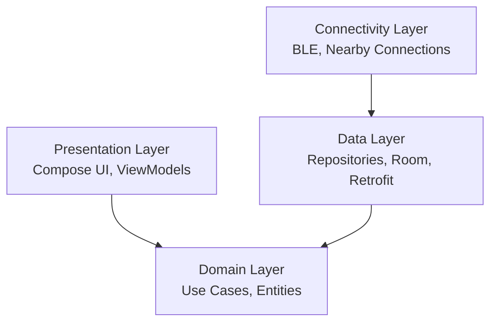

  
  # 🏗 Linker Architecture Guide
  
  **Clean Architecture • MVVM • Modular Design**

---

Linker is built on robust **Clean Architecture** principles to ensure that as the app scales, it remains testable, maintainable, and completely independent of external frameworks where possible.

## 📐 The Layered Approach

### 1. Presentation Layer (UI)
**Responsibility**: Renders the UI and handles user interactions.
- **Framework**: Jetpack Compose (100% Kotlin UI).
- **State Management**: `StateFlow` in ViewModels.
- **Pattern**: MVVM. The UI strictly observes state from ViewModels and triggers events.

### 2. Domain Layer
**Responsibility**: The heart of the application. Contains all business rules.
- **Zero Android Dependencies**: This layer knows nothing about Android SDK, Room, or Firebase.
- **Components**:
  - `UseCases`: Classes with a single responsibility (e.g., `SendMessageUseCase`).
  - `Domain Models`: Pure Kotlin data classes.
  - `Repository Interfaces`: Contracts that the Data layer must fulfill.

### 3. Data Layer
**Responsibility**: Manages data retrieval and persistence.
- **Single Source of Truth**: Repositories determine whether to fetch data from the Local Cache (Room) or Remote APIs (Firebase/Supabase).
- **Mappers**: Transforms DTOs and Database Entities into Domain Models.

### 4. Connectivity Layer (The Magic)
**Responsibility**: Manages the offline-first mesh network.
- **BLE Mesh**: Custom implementation for low-bandwidth message hopping.
- **Nearby Connections**: High-bandwidth P2P transfers for media.

---

## 🔄 Data Flow: Sending a Message

How a message flows through the system, demonstrating our Offline-First strategy:

1. **User Input**: User taps "Send" in `ChatMessageScreen`.
2. **ViewModel**: Calls `SendMessageUseCase(content)`.
3. **Use Case**: Validates content, then calls `ChatRepository.sendMessage()`.
4. **Repository Strategy**:
   - Immediately writes to **Room DB** (Local Cache).
   - *UI Updates instantly via Flow observation.*
   - Attempts to send to **Firestore**.
   - If offline: Queues the message in **WorkManager** and attempts to route via **BLE Mesh**.

---

## 🚀 Performance & Optimization

- **Database**: Room tables are heavily indexed. Large lists are loaded via Android Paging 3.
- **Memory**: Images are aggressively cached using Coil.
- **Compose**: Extensive use of `remember`, `derivedStateOf`, and `key` blocks to prevent unnecessary recompositions.

## 🎯 Design Patterns Used
- **Repository Pattern**: Abstracts data sources.
- **Observer Pattern**: Reactive UI via `StateFlow`.
- **Dependency Injection**: Hilt provides compile-time safety and easy testing.
- **Result Wrapper**: All domain operations return a `Result<T>` (Success, Error, Loading) for safe state handling.
